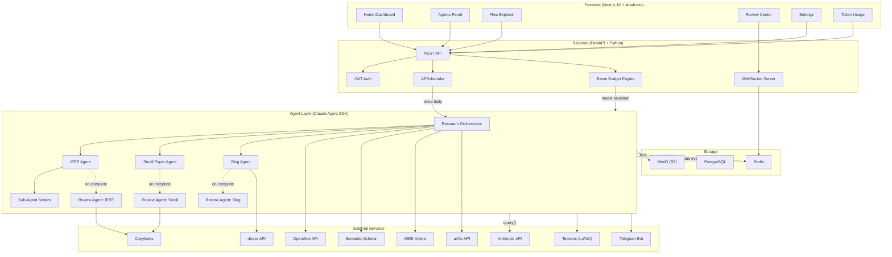
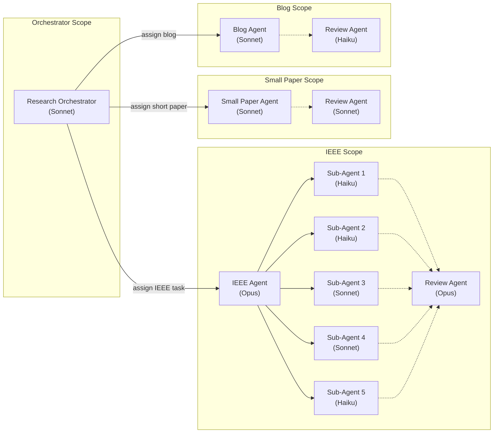
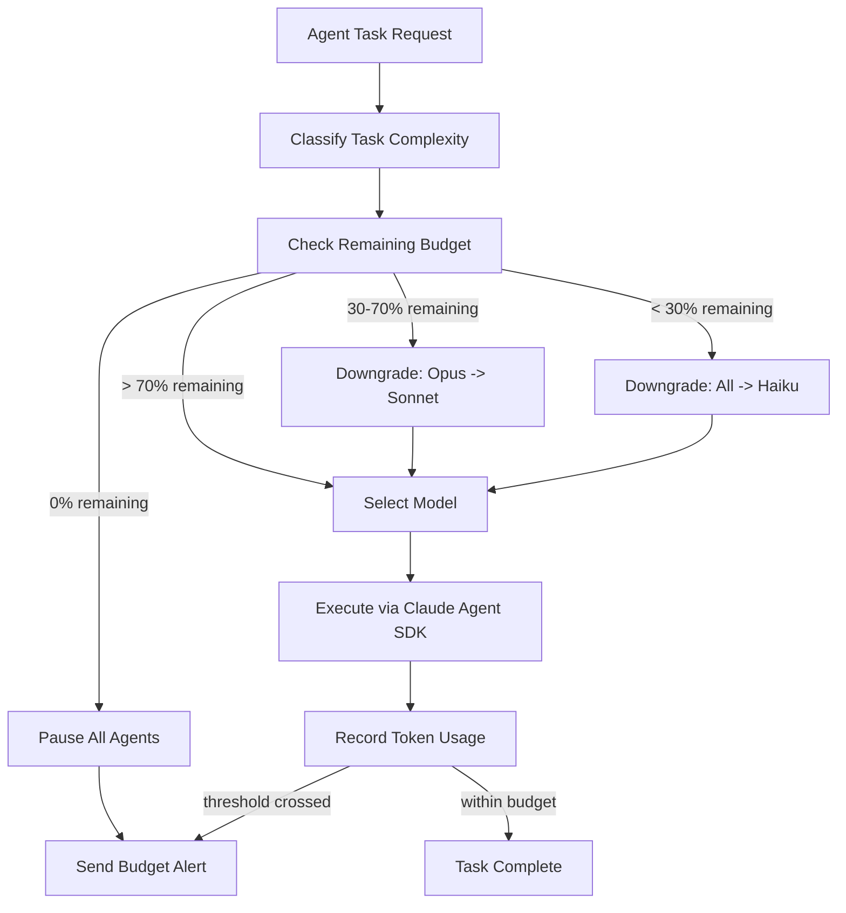
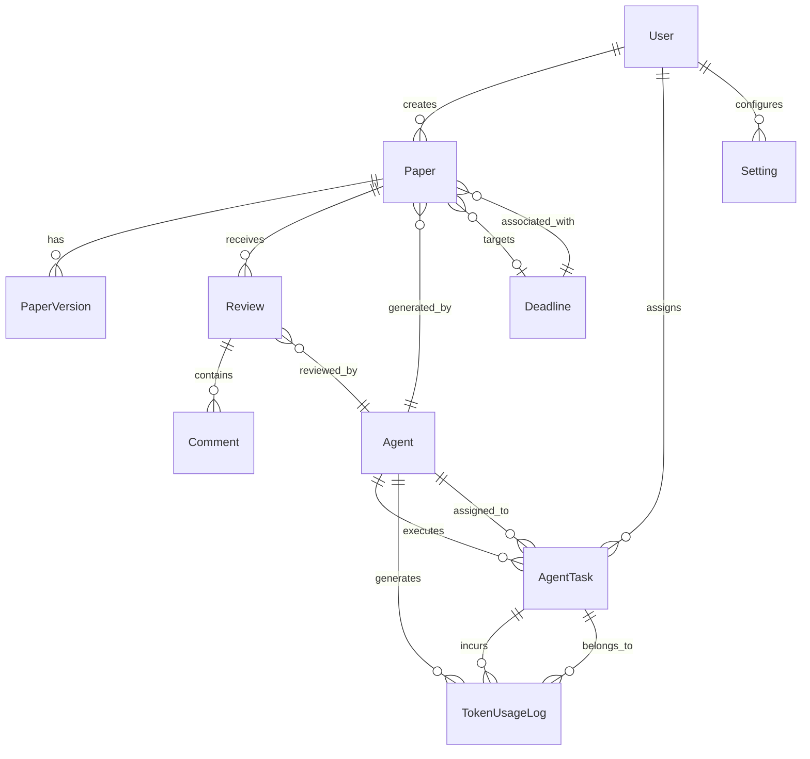
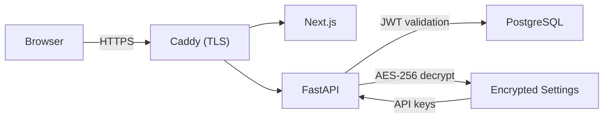

# Quorum -- System Architecture Document

**Version:** 1.0
**Date:** April 10, 2026
**Status:** Draft

---

## 1. Architecture Overview

Quorum is a four-layer system: a React frontend dashboard, a Python API backend, an AI agent orchestration layer built on the Claude Agent SDK, and a persistence/infrastructure layer.



---

## 2. Layer Descriptions

### 2.1 Frontend Layer

| Technology | Purpose |
|-----------|---------|
| Next.js 16 | React framework with App Router, server components, API routes |
| shadcn/ui | Component library (buttons, dialogs, tables, tabs, cards) |
| Tailwind CSS v4 | Utility-first styling with dark mode |
| PDF.js | In-browser LaTeX/PDF document preview |
| Recharts | Token usage charts and agent performance graphs |
| Zustand | Client-side state management |
| React Hook Form + Zod | Form handling and validation |

The frontend communicates with the backend via REST for CRUD operations and WebSocket for real-time agent status updates. Authentication uses JWT tokens stored in httpOnly cookies.

### 2.2 Backend Layer

| Technology | Purpose |
|-----------|---------|
| FastAPI | Async Python web framework for REST + WebSocket endpoints |
| SQLAlchemy 2.0 | ORM for PostgreSQL with async support |
| Alembic | Database migration management |
| APScheduler | Cron-style job scheduler for twice-daily agent triggers |
| Pydantic v2 | Request/response validation and serialization |
| python-jose | JWT token generation and validation |
| boto3 / minio | S3-compatible file storage client |
| redis-py | Redis client for pub/sub and task queue |

### 2.3 Agent Layer

Built entirely on the **Claude Agent SDK** (Python). Each agent type is defined as an `AgentDefinition` with specialized system prompts, tool access, and model assignments.



#### Agent SDK Integration Pattern

```python
from claude_agent_sdk import query, ClaudeAgentOptions, AgentDefinition

AGENTS = {
    "ieee-researcher": AgentDefinition(
        description="IEEE conference paper researcher and writer.",
        prompt=IEEE_SYSTEM_PROMPT,
        tools=["Read", "Write", "Bash", "WebSearch", "WebFetch", "Agent"],
        model="claude-opus-4-20250514",
    ),
    "small-paper": AgentDefinition(
        description="Short/workshop paper writer.",
        prompt=SMALL_PAPER_SYSTEM_PROMPT,
        tools=["Read", "Write", "WebSearch", "WebFetch"],
        model="claude-sonnet-4-20250514",
    ),
    "blog-writer": AgentDefinition(
        description="Implementation-focused blog article writer.",
        prompt=BLOG_SYSTEM_PROMPT,
        tools=["Read", "Write", "Bash", "WebSearch", "WebFetch"],
        model="claude-sonnet-4-20250514",
    ),
    "reviewer-ieee": AgentDefinition(
        description="IEEE paper peer reviewer.",
        prompt=IEEE_REVIEW_PROMPT,
        tools=["Read", "WebSearch", "WebFetch"],
        model="claude-opus-4-20250514",
    ),
    "reviewer-small": AgentDefinition(
        description="Short paper reviewer.",
        prompt=SMALL_REVIEW_PROMPT,
        tools=["Read", "WebSearch"],
        model="claude-sonnet-4-20250514",
    ),
    "reviewer-blog": AgentDefinition(
        description="Blog article reviewer.",
        prompt=BLOG_REVIEW_PROMPT,
        tools=["Read"],
        model="claude-haiku-4-20250514",
    ),
}

async def run_orchestrator():
    async for message in query(
        prompt=build_orchestrator_prompt(topics, deadlines),
        options=ClaudeAgentOptions(
            allowed_tools=["Read", "WebSearch", "WebFetch", "Agent"],
            agents=AGENTS,
            model="claude-sonnet-4-20250514",
        ),
    ):
        await process_message(message)
```

### 2.4 Storage Layer

| Component | Data | Access Pattern |
|-----------|------|---------------|
| **PostgreSQL** | User settings, agent metadata, task records, review comments, token usage logs, deadline entries | Relational queries, aggregations for dashboard |
| **MinIO (S3)** | LaTeX source files, compiled PDFs, images, blog markdown files | Object storage with presigned URLs for download |
| **Redis** | Task queue (agent jobs), pub/sub (real-time status), session cache | High-throughput reads/writes, ephemeral data |

---

## 3. Token Budget Engine Architecture

The Token Budget Engine is a middleware layer that wraps all Claude Agent SDK calls to enforce cost controls and intelligent model routing.



### 3.1 Task Classification Matrix

| Task Type | Default Model | Complexity Tier | Rationale |
|-----------|--------------|----------------|-----------|
| Trend scanning, metadata extraction | Haiku | Simple | Structured data extraction, low reasoning |
| Citation formatting, BibTeX generation | Haiku | Simple | Template-driven transformation |
| Status summaries, progress reports | Haiku | Simple | Summarization of known data |
| Literature survey, related work | Sonnet | Standard | Multi-source synthesis, moderate reasoning |
| Paper structure and section writing | Sonnet | Standard | Coherent long-form generation |
| Blog writing + code generation | Sonnet | Standard | Creative + technical generation |
| Orchestration decisions, task routing | Sonnet | Standard | Decision-making with context |
| Novel methodology creation | Opus | Deep | Original research thinking required |
| Deep analysis, peer review simulation | Opus | Deep | Critical evaluation, nuanced judgment |
| Research ideation, extension brainstorming | Opus | Deep | Creative + analytical reasoning |

### 3.2 Cost Estimation

| Scenario | Daily Token Est. | Daily Cost | Monthly Cost |
|----------|-----------------|------------|-------------|
| All Opus | ~2M input, ~500K output | ~$22.50 | ~$675 |
| All Sonnet | ~2M input, ~500K output | ~$13.50 | ~$405 |
| Optimized routing | ~2M input, ~500K output | ~$7-10 | ~$210-300 |
| Budget-constrained (mostly Haiku) | ~2M input, ~500K output | ~$4.50 | ~$135 |

---

## 4. Data Model Overview

See [SPEC-008-data-model.md](specs/SPEC-008-data-model.md) for the full schema. Summary of core entities:



### Core Tables

- **users** -- Authentication, API keys (encrypted), preferences
- **agents** -- Agent type, model assignment, system prompt reference, status
- **agent_tasks** -- Task queue with status, assigned agent, input/output references
- **papers** -- Generated documents with type (IEEE/short/blog), status, file references
- **paper_versions** -- Version history for iterative review cycles
- **reviews** -- Review records with verdict (approve/reject/revise), linked to paper versions
- **comments** -- Inline review comments with position metadata
- **token_usage_logs** -- Per-call token tracking: agent, task, model, input/output tokens, cost, timestamp
- **deadlines** -- Conference/journal submission dates with venue metadata
- **settings** -- Key-value user configuration (API keys, notification prefs, niche topics)

---

## 5. API Architecture

### 5.1 REST API (FastAPI)

Base URL: `/api/v1`

| Group | Endpoints | Auth |
|-------|----------|------|
| Auth | `POST /auth/login`, `POST /auth/refresh`, `GET /auth/me` | Public / JWT |
| Papers | `GET /papers`, `GET /papers/:id`, `GET /papers/:id/versions`, `DELETE /papers/:id` | JWT |
| Agents | `GET /agents`, `GET /agents/:id`, `GET /agents/:id/tasks`, `POST /agents/:id/tasks` | JWT |
| Tasks | `GET /tasks`, `GET /tasks/:id`, `PATCH /tasks/:id` | JWT |
| Reviews | `GET /reviews`, `POST /reviews`, `GET /reviews/:id`, `PATCH /reviews/:id` | JWT |
| Comments | `POST /reviews/:id/comments`, `GET /reviews/:id/comments` | JWT |
| Files | `GET /files/:id/download`, `GET /files/:id/preview` | JWT |
| Publishing | `POST /publish/devto`, `GET /publish/status/:id` | JWT |
| Deadlines | `GET /deadlines`, `POST /deadlines`, `DELETE /deadlines/:id` | JWT |
| Token Usage | `GET /tokens/usage`, `GET /tokens/budget`, `PUT /tokens/budget` | JWT |
| Settings | `GET /settings`, `PUT /settings` | JWT |
| Scheduler | `POST /scheduler/trigger`, `GET /scheduler/status` | JWT |

### 5.2 WebSocket API

Endpoint: `ws://host/ws`

Events streamed from server to client:

| Event | Payload | Trigger |
|-------|---------|---------|
| `agent.status` | `{agent_id, status, current_task}` | Agent starts/stops/errors |
| `task.progress` | `{task_id, agent_id, phase, percent}` | Task phase transitions |
| `paper.created` | `{paper_id, title, type, agent_id}` | New paper generated |
| `review.completed` | `{review_id, paper_id, verdict}` | Review finished |
| `token.usage` | `{agent_id, model, tokens_used, cost}` | After each API call |
| `budget.alert` | `{level, remaining_pct, message}` | Budget threshold crossed |
| `notification` | `{type, message, action_url}` | General notifications |

---

## 6. Infrastructure

### 6.1 Development Environment

```
docker-compose.yml
├── frontend      (Next.js dev server, port 3000)
├── backend       (FastAPI with uvicorn, port 8000)
├── postgres      (PostgreSQL 16, port 5432)
├── redis         (Redis 7, port 6379)
├── minio         (MinIO S3, ports 9000/9001)
└── tectonic      (LaTeX compilation service, port 8001)
```

### 6.2 Production Deployment (VPS)

- **VPS Provider**: Any Linux VPS with 4+ CPU cores, 8GB+ RAM, 100GB+ SSD
- **OS**: Ubuntu 24.04 LTS
- **Process Management**: systemd services for backend + agent workers
- **Reverse Proxy**: Caddy (auto-TLS) or nginx
- **Database**: Managed PostgreSQL (or self-hosted with automated backups)
- **File Storage**: MinIO (self-hosted S3) or AWS S3 / Cloudflare R2
- **Monitoring**: Structured JSON logs -> Grafana Loki (optional)

### 6.3 Security Architecture



- All API keys (Anthropic, dev.to, Telegram, Copyleaks) stored AES-256 encrypted in the `settings` table
- JWT tokens with 24-hour expiry, refresh token rotation
- CORS restricted to dashboard origin
- Rate limiting on auth endpoints (5 attempts per minute)
- No secrets in environment variables in production (loaded from encrypted DB)

---

## 7. Technology Stack Summary

| Layer | Technology | Version |
|-------|-----------|---------|
| Frontend Framework | Next.js | 16.x |
| UI Components | shadcn/ui | Latest |
| CSS | Tailwind CSS | 4.x |
| State Management | Zustand | 5.x |
| Charts | Recharts | 2.x |
| PDF Viewer | PDF.js | Latest |
| Backend Framework | FastAPI | 0.115+ |
| ORM | SQLAlchemy | 2.0+ |
| Migrations | Alembic | 1.13+ |
| Scheduler | APScheduler | 3.10+ |
| Agent SDK | claude-agent-sdk | Latest |
| Database | PostgreSQL | 16 |
| Cache/Queue | Redis | 7.x |
| Object Storage | MinIO | Latest |
| LaTeX Engine | Tectonic | Latest |
| Plagiarism | Copyleaks API | v3 |
| Notifications | Telegram Bot API | 9.x |
| Publishing | dev.to REST API | v1 |
| Containerization | Docker + Compose | Latest |
| Reverse Proxy | Caddy | 2.x |
