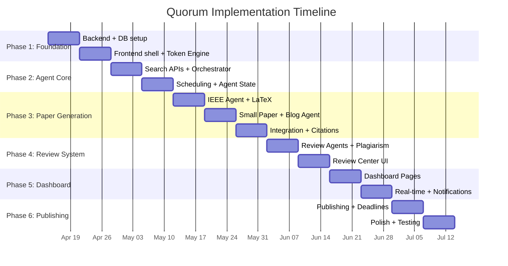

# Quorum -- Implementation Plan

**Version:** 1.0
**Date:** April 10, 2026
**Duration:** 13 weeks (6 phases)
**Status:** Draft

---

## Project Structure

```
Quorum/
├── frontend/                # Next.js 16 dashboard
│   ├── app/                 # App Router pages
│   │   ├── (auth)/          # Login/setup pages
│   │   ├── dashboard/       # Home dashboard
│   │   ├── agents/          # Agent panels
│   │   ├── files/           # Files explorer
│   │   ├── review/          # Review center
│   │   ├── tokens/          # Token usage dashboard
│   │   ├── deadlines/       # Submission deadline tracker
│   │   └── settings/        # Settings panel
│   ├── components/          # Shared UI components
│   │   ├── ui/              # shadcn/ui primitives
│   │   ├── layout/          # Shell, sidebar, header
│   │   ├── review/          # 3-panel review components
│   │   ├── charts/          # Recharts wrappers
│   │   └── agents/          # Agent status cards
│   ├── lib/                 # Utilities, API client, auth
│   ├── hooks/               # Custom React hooks
│   └── stores/              # Zustand stores
├── backend/                 # FastAPI Python backend
│   ├── app/
│   │   ├── api/             # Route handlers
│   │   │   ├── auth.py
│   │   │   ├── papers.py
│   │   │   ├── agents.py
│   │   │   ├── tasks.py
│   │   │   ├── reviews.py
│   │   │   ├── files.py
│   │   │   ├── publishing.py
│   │   │   ├── deadlines.py
│   │   │   ├── tokens.py
│   │   │   ├── settings.py
│   │   │   └── scheduler.py
│   │   ├── models/          # SQLAlchemy models
│   │   ├── schemas/         # Pydantic schemas
│   │   ├── services/        # Business logic
│   │   ├── core/            # Config, security, deps
│   │   └── ws/              # WebSocket handlers
│   ├── alembic/             # Database migrations
│   └── tests/
├── agents/                  # Claude Agent SDK agents
│   ├── orchestrator/        # Research Orchestrator
│   │   ├── agent.py         # Agent definition + runner
│   │   ├── prompts.py       # System prompts
│   │   └── tools.py         # Custom tools (search APIs)
│   ├── ieee/                # IEEE Research Agent
│   │   ├── agent.py
│   │   ├── prompts.py
│   │   ├── templates/       # LaTeX templates
│   │   └── tools.py
│   ├── small_paper/         # Small Paper Agent
│   │   ├── agent.py
│   │   ├── prompts.py
│   │   └── templates/
│   ├── blog/                # Blog Implementation Agent
│   │   ├── agent.py
│   │   ├── prompts.py
│   │   └── tools.py
│   ├── reviewers/           # Review Agents
│   │   ├── ieee_reviewer.py
│   │   ├── small_reviewer.py
│   │   ├── blog_reviewer.py
│   │   └── prompts.py
│   ├── token_engine/        # Token Budget Engine
│   │   ├── engine.py        # Core budget logic
│   │   ├── classifier.py    # Task complexity classifier
│   │   ├── router.py        # Model selection router
│   │   └── tracker.py       # Usage tracking + logging
│   └── shared/              # Shared agent utilities
│       ├── search.py        # Paper search API clients
│       ├── latex.py          # LaTeX utilities
│       ├── notifications.py # Telegram integration
│       └── storage.py       # MinIO/S3 helpers
├── docker-compose.yml
├── docker-compose.prod.yml
├── Dockerfile.backend
├── Dockerfile.frontend
├── docs/                    # Documentation (this folder)
└── README.md
```

---

## Phase 1 -- Foundation (Weeks 1-2)

### Goal
Stand up the project skeleton, database, storage, authentication, and the basic dashboard shell.

### Week 1: Backend + Database

| Task | Description | Output |
|------|-------------|--------|
| 1.1 | Initialize monorepo with `frontend/`, `backend/`, `agents/`, `docs/` | Project structure |
| 1.2 | Set up FastAPI project with Pydantic v2, async SQLAlchemy 2.0 | `backend/app/` |
| 1.3 | Create SQLAlchemy models for all core tables (users, agents, papers, tasks, reviews, comments, token_usage_logs, settings, deadlines) | `backend/app/models/` |
| 1.4 | Set up Alembic migrations and generate initial migration | `backend/alembic/` |
| 1.5 | Implement JWT authentication (login, refresh, middleware) | `backend/app/core/security.py` |
| 1.6 | Implement AES-256 encryption service for API key storage | `backend/app/core/encryption.py` |
| 1.7 | Set up MinIO client with bucket creation and presigned URL generation | `backend/app/services/storage.py` |
| 1.8 | Write Docker Compose file with PostgreSQL 16, Redis 7, MinIO | `docker-compose.yml` |
| 1.9 | Implement basic CRUD endpoints for settings | `backend/app/api/settings.py` |

### Week 2: Frontend Shell + Token Engine Core

| Task | Description | Output |
|------|-------------|--------|
| 2.1 | Initialize Next.js 16 project with TypeScript, Tailwind v4, shadcn/ui | `frontend/` |
| 2.2 | Build app shell: sidebar navigation, header, dark mode toggle | `frontend/components/layout/` |
| 2.3 | Create login page with JWT token handling | `frontend/app/(auth)/` |
| 2.4 | Build Settings page: API key input, niche topic list, notification config | `frontend/app/settings/` |
| 2.5 | Implement Token Budget Engine core: budget tracking, threshold checks | `agents/token_engine/engine.py` |
| 2.6 | Implement task complexity classifier (rule-based, keyword matching) | `agents/token_engine/classifier.py` |
| 2.7 | Implement model router with budget-aware downgrade logic | `agents/token_engine/router.py` |
| 2.8 | Implement token usage tracker with PostgreSQL logging | `agents/token_engine/tracker.py` |
| 2.9 | Write unit tests for Token Budget Engine | `agents/token_engine/tests/` |

### Phase 1 Milestone
- Docker Compose starts all services
- User can log in, save settings (encrypted API keys), and configure niche topics
- Token Budget Engine passes unit tests for budget enforcement and model routing

---

## Phase 2 -- Agent Core (Weeks 3-4)

### Goal
Build the Research Orchestrator, integrate all paper search APIs, and establish the scheduling system.

### Week 3: Search Integrations + Orchestrator

| Task | Description | Output |
|------|-------------|--------|
| 3.1 | Implement OpenAlex API client (search by topic, get trending papers) | `agents/shared/search.py` |
| 3.2 | Implement arXiv API client (query, parse Atom feed) | `agents/shared/search.py` |
| 3.3 | Implement Semantic Scholar API client (paper search, recommendations) | `agents/shared/search.py` |
| 3.4 | Implement IEEE Xplore API client (metadata search) | `agents/shared/search.py` |
| 3.5 | Build unified search interface that queries all four APIs and deduplicates | `agents/shared/search.py` |
| 3.6 | Write Research Orchestrator system prompt with topic ranking instructions | `agents/orchestrator/prompts.py` |
| 3.7 | Implement Research Orchestrator agent using Claude Agent SDK | `agents/orchestrator/agent.py` |
| 3.8 | Build topic ranking pipeline (novelty score, citation potential, niche relevance) | `agents/orchestrator/agent.py` |

### Week 4: Scheduling + Agent State

| Task | Description | Output |
|------|-------------|--------|
| 4.1 | Implement APScheduler with configurable twice-daily cron triggers | `backend/app/services/scheduler.py` |
| 4.2 | Build scheduler API endpoints (trigger, status, configure) | `backend/app/api/scheduler.py` |
| 4.3 | Implement Telegram bot setup and topic notification with inline keyboard | `agents/shared/notifications.py` |
| 4.4 | Build Telegram webhook handler for user topic selection responses | `backend/app/api/telegram.py` |
| 4.5 | Implement agent task persistence (create, update status, store results) | `backend/app/services/tasks.py` |
| 4.6 | Implement agent session management (resume context across runs) | `agents/shared/sessions.py` |
| 4.7 | Build Agents API endpoints (list, status, tasks, history) | `backend/app/api/agents.py` |
| 4.8 | Integration test: Orchestrator discovers topics -> sends to Telegram -> user selects -> task created | End-to-end flow |

### Phase 2 Milestone
- Scheduler triggers Research Orchestrator at configured times
- Orchestrator queries all four search APIs and ranks topics
- User receives Telegram notification and can select topics
- Selected topics become tasks in the database

---

## Phase 3 -- Paper Generation (Weeks 5-7)

### Goal
Implement all three content generation agents with LaTeX support and sub-agent swarm.

### Week 5: IEEE Agent + LaTeX Pipeline

| Task | Description | Output |
|------|-------------|--------|
| 5.1 | Set up IEEE LaTeX templates (conference 2-column, journal) | `agents/ieee/templates/` |
| 5.2 | Implement LaTeX compilation service using Tectonic | `agents/shared/latex.py` |
| 5.3 | Write IEEE Agent system prompt (formatting rules, section structure, citation requirements, novelty expectations) | `agents/ieee/prompts.py` |
| 5.4 | Implement IEEE Agent with sub-agent spawning (5-6 research directions) | `agents/ieee/agent.py` |
| 5.5 | Build citation verification tool (check DOIs against OpenAlex/Semantic Scholar) | `agents/ieee/tools.py` |
| 5.6 | Implement MinIO file upload for generated LaTeX + PDF | `agents/shared/storage.py` |
| 5.7 | Build Papers API endpoints (list, get, versions, download) | `backend/app/api/papers.py` |

### Week 6: Small Paper Agent + Blog Agent

| Task | Description | Output |
|------|-------------|--------|
| 6.1 | Set up short paper LaTeX templates (4-page, 2-page poster) | `agents/small_paper/templates/` |
| 6.2 | Write Small Paper Agent system prompt | `agents/small_paper/prompts.py` |
| 6.3 | Implement Small Paper Agent | `agents/small_paper/agent.py` |
| 6.4 | Write Blog Agent system prompt (implementation-first, human tone, series structure) | `agents/blog/prompts.py` |
| 6.5 | Implement Blog Agent with code generation and Markdown output | `agents/blog/agent.py` |
| 6.6 | Build blog image/diagram generation tool | `agents/blog/tools.py` |
| 6.7 | Implement Part 1/2/3 series structuring logic | `agents/blog/agent.py` |

### Week 7: Integration + Citation Management

| Task | Description | Output |
|------|-------------|--------|
| 7.1 | Build BibTeX management utilities (parse, validate, format) | `agents/shared/citations.py` |
| 7.2 | Implement citation cross-referencing against real paper databases | `agents/shared/citations.py` |
| 7.3 | Connect all agents to Token Budget Engine for model routing | `agents/*/agent.py` |
| 7.4 | Integration test: full paper generation flow (topic -> LaTeX -> PDF) | End-to-end flow |
| 7.5 | Integration test: full blog generation flow (topic -> Markdown series) | End-to-end flow |
| 7.6 | Performance tuning: optimize prompt sizes, enable caching for system prompts | All agents |

### Phase 3 Milestone
- IEEE Agent generates complete LaTeX papers with valid citations
- Small Paper Agent produces 4-page workshop papers
- Blog Agent produces 3-part Markdown article series with code
- All agents route through Token Budget Engine
- PDFs compile correctly via Tectonic

---

## Phase 4 -- Review System (Weeks 8-9)

### Goal
Implement automated review agents, plagiarism checking, the review feedback loop, and the Review Center UI.

### Week 8: Review Agents + Plagiarism

| Task | Description | Output |
|------|-------------|--------|
| 8.1 | Write IEEE Review Agent system prompt (formatting compliance, novelty assessment, citation validity, logical consistency) | `agents/reviewers/prompts.py` |
| 8.2 | Implement IEEE Review Agent | `agents/reviewers/ieee_reviewer.py` |
| 8.3 | Implement Small Paper Review Agent | `agents/reviewers/small_reviewer.py` |
| 8.4 | Implement Blog Review Agent | `agents/reviewers/blog_reviewer.py` |
| 8.5 | Integrate Copyleaks API for plagiarism checking | `agents/shared/plagiarism.py` |
| 8.6 | Build review feedback loop: reject -> feedback -> agent rework -> re-review (max 3 cycles) | `backend/app/services/review_loop.py` |
| 8.7 | Build Reviews API endpoints (create, list, update verdict) | `backend/app/api/reviews.py` |
| 8.8 | Build Comments API endpoints (add, list per review) | `backend/app/api/reviews.py` |

### Week 9: Review Center UI

| Task | Description | Output |
|------|-------------|--------|
| 9.1 | Build Review Center page with 3-panel layout | `frontend/app/review/` |
| 9.2 | Implement left panel: filterable list of papers pending review | `frontend/components/review/` |
| 9.3 | Integrate PDF.js for center panel document viewer | `frontend/components/review/` |
| 9.4 | Build right panel: comment list + "Add Note" form | `frontend/components/review/` |
| 9.5 | Implement "Send Feedback" flow: collects comments -> sends to backend -> triggers agent rework | End-to-end flow |
| 9.6 | Implement "Approve" flow: moves paper to approved status, updates file listing | End-to-end flow |
| 9.7 | Add review status badges (pending, in review, revisions requested, approved) | UI components |

### Phase 4 Milestone
- Review agents automatically validate generated papers
- Plagiarism check runs on every paper before human review
- User can review papers in the 3-panel Review Center
- Feedback triggers agent rework; approval moves papers to "approved" tab

---

## Phase 5 -- Dashboard & Notifications (Weeks 10-11)

### Goal
Build the complete dashboard experience with real-time updates, token monitoring, and notification integration.

### Week 10: Dashboard Pages

| Task | Description | Output |
|------|-------------|--------|
| 10.1 | Build Home Dashboard: recent outputs feed, active agent cards, notification bell | `frontend/app/dashboard/` |
| 10.2 | Build Agents Panel: per-agent view with Files, Tasks, History tabs | `frontend/app/agents/` |
| 10.3 | Build Files Explorer: sortable table with preview, download, status filters (approved/pending/rejected) | `frontend/app/files/` |
| 10.4 | Build Token Usage page: per-agent cost breakdown (pie chart), daily/monthly trend (line chart), budget remaining (gauge), model distribution (bar chart) | `frontend/app/tokens/` |
| 10.5 | Implement Recharts components for all dashboard charts | `frontend/components/charts/` |
| 10.6 | Build token usage API endpoints (aggregated queries, budget status) | `backend/app/api/tokens.py` |

### Week 11: Real-time + Notifications

| Task | Description | Output |
|------|-------------|--------|
| 11.1 | Implement WebSocket server with Redis pub/sub for real-time events | `backend/app/ws/` |
| 11.2 | Build WebSocket client hook in frontend for agent status streaming | `frontend/hooks/useWebSocket.ts` |
| 11.3 | Add real-time status indicators on agent cards and task lists | UI updates |
| 11.4 | Implement Telegram notification templates: topic suggestions, review-ready, budget alerts, daily summary | `agents/shared/notifications.py` |
| 11.5 | Build Settings page connectors: Telegram bot token, dev.to API key, Anthropic key, niche topics manager | `frontend/app/settings/` |
| 11.6 | Implement manual task assignment from Agents Panel | `frontend/app/agents/` |
| 11.7 | Add deadline management UI with countdown timers | `frontend/app/deadlines/` |

### Phase 5 Milestone
- Full dashboard with all pages functional
- Real-time agent status updates via WebSocket
- Token usage dashboard shows costs, trends, and budget status
- Telegram notifications for all key events
- User can manually assign tasks to agents

---

## Phase 6 -- Publishing & Polish (Weeks 12-13)

### Goal
Complete the publishing pipeline, add deadline tracking, polish the UI, and perform end-to-end testing.

### Week 12: Publishing + Deadlines

| Task | Description | Output |
|------|-------------|--------|
| 12.1 | Implement dev.to API integration (create article, update, series linking) | `backend/app/services/publishing.py` |
| 12.2 | Build "Publish to dev.to" button in Review Center for approved blog articles | `frontend/components/review/` |
| 12.3 | Implement draft vs. live publishing toggle | UI + API |
| 12.4 | Build canonical URL generation for Medium cross-posting | `backend/app/services/publishing.py` |
| 12.5 | Implement submission deadline database with IEEE ICBC 2026, MetroAutomotive, and other relevant venues | Seed data |
| 12.6 | Build deadline tracker page with countdown, associated papers, and alerts | `frontend/app/deadlines/` |
| 12.7 | Implement journal/conference recommendation engine (match paper topic to venue scope) | `agents/shared/recommendations.py` |

### Week 13: Polish + Testing

| Task | Description | Output |
|------|-------------|--------|
| 13.1 | Human-tone calibration: tune Blog Agent prompts to minimize AI-detectable patterns | Prompt refinement |
| 13.2 | Add image/diagram generation for IEEE papers (architecture diagrams, result plots) | `agents/shared/images.py` |
| 13.3 | End-to-end test: full daily cycle (discover -> generate -> review -> approve -> publish) | Integration test |
| 13.4 | Load testing: simulate 20 concurrent sub-agents | Performance test |
| 13.5 | Security audit: verify encrypted storage, JWT handling, input sanitization | Security review |
| 13.6 | Write production Docker Compose with resource limits, health checks, restart policies | `docker-compose.prod.yml` |
| 13.7 | Write deployment guide and README | `README.md` |
| 13.8 | UI polish: loading states, error boundaries, empty states, responsive breakpoints | UI refinement |

### Phase 6 Milestone
- Blog articles publish directly to dev.to from the dashboard
- Deadline tracker shows upcoming conferences with countdowns
- Full daily cycle works end-to-end autonomously
- Production Docker Compose is ready for VPS deployment

---

## Dependency Graph



---

## Risk Mitigation During Implementation

| Risk | When | Mitigation |
|------|------|-----------|
| Claude Agent SDK API changes | Phase 2-3 | Pin SDK version; abstract SDK calls behind service layer |
| IEEE Xplore API key approval delayed | Phase 2 | Use OpenAlex + arXiv as primary; IEEE Xplore is supplementary |
| LaTeX compilation failures | Phase 3 | Extensive template testing; fallback to Overleaf export format |
| Copyleaks API rate limits | Phase 4 | Batch plagiarism checks; cache results per paper version |
| Token costs spike during development | All phases | Set strict dev budget ($5/day); use Haiku for all dev testing |
| dev.to API rate limiting | Phase 6 | Implement exponential backoff; publish during off-peak hours |

---

## Definition of Done

A phase is considered complete when:

1. All listed tasks are implemented and code-reviewed
2. Unit tests pass for new services and utilities
3. Integration tests validate the end-to-end flow for that phase
4. The feature is accessible from the dashboard (if UI-facing)
5. Documentation is updated to reflect any API or architecture changes
6. Token Budget Engine correctly tracks all new agent activity
