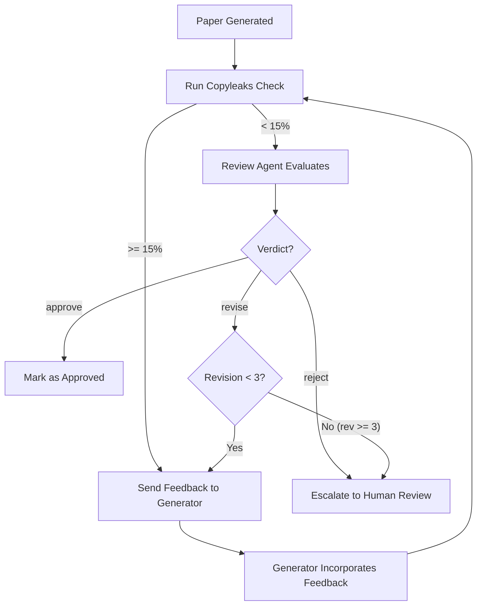

# SPEC-005: Review Agents

**Status:** Draft
**Priority:** P0
**Phase:** 4 (Week 8)
**Dependencies:** SPEC-002 (IEEE Agent), SPEC-003 (Small Paper), SPEC-004 (Blog Agent), SPEC-006 (Token Engine)

---

## 1. Overview

Review Agents simulate the academic peer review process. There is one review agent per content type (IEEE, Small Paper, Blog). Each validates the generated output for formatting compliance, plagiarism, logical consistency, citation validity, and novelty. Rejected papers are sent back to the generating agent with structured feedback for rework, capped at 3 revision cycles.

## 2. Agent Configurations

### 2.1 IEEE Review Agent

```python
IEEE_REVIEWER = AgentDefinition(
    description="IEEE paper peer reviewer. Validates formatting, citations, novelty, and logical consistency.",
    prompt=IEEE_REVIEW_PROMPT,
    tools=["Read", "WebSearch", "WebFetch"],
    model="claude-opus-4-20250514",  # deep reasoning for quality assessment
)
```

### 2.2 Small Paper Review Agent

```python
SMALL_REVIEWER = AgentDefinition(
    description="Short paper reviewer. Validates format and contribution clarity.",
    prompt=SMALL_REVIEW_PROMPT,
    tools=["Read", "WebSearch"],
    model="claude-sonnet-4-20250514",
)
```

### 2.3 Blog Review Agent

```python
BLOG_REVIEWER = AgentDefinition(
    description="Blog article reviewer. Validates code correctness, tone, and readability.",
    prompt=BLOG_REVIEW_PROMPT,
    tools=["Read", "Bash"],  # Bash to test code snippets
    model="claude-haiku-4-20250514",
)
```

### Model Assignment Rationale

| Reviewer | Model | Cost/1M input | Rationale |
|----------|-------|--------------|-----------|
| IEEE | Opus | $5 | Requires nuanced judgment on novelty, methodology soundness |
| Small Paper | Sonnet | $3 | Simpler structure, fewer sections to validate |
| Blog | Haiku | $1 | Focus on code correctness and tone (pattern matching) |

## 3. Review Criteria

### 3.1 IEEE Paper Review Checklist

| Category | Check | Severity | Auto-Detectable |
|----------|-------|----------|-----------------|
| **Format** | Uses IEEEtran document class | Blocker | Yes |
| **Format** | 2-column layout, correct margins | Blocker | Yes |
| **Format** | Page count <= 8 (excl. references) | Blocker | Yes |
| **Format** | Abstract 150-250 words | Major | Yes |
| **Format** | All required sections present | Blocker | Yes |
| **Citations** | Minimum 15 references | Major | Yes |
| **Citations** | All citations have valid BibTeX entries | Blocker | Yes |
| **Citations** | >= 30% of citations from last 3 years | Minor | Yes |
| **Citations** | No hallucinated references (verified against APIs) | Blocker | Yes (via tool) |
| **Novelty** | Clear contribution statement in Introduction | Blocker | LLM judgment |
| **Novelty** | Methodology differs from reference papers | Blocker | LLM judgment |
| **Novelty** | Results show improvement or new insight | Major | LLM judgment |
| **Logic** | Methodology supports claimed results | Blocker | LLM judgment |
| **Logic** | Experimental setup is reproducible | Major | LLM judgment |
| **Logic** | Conclusion follows from results | Major | LLM judgment |
| **Plagiarism** | Copyleaks similarity < 15% | Blocker | Yes (via API) |
| **Writing** | No grammatical errors | Minor | Yes |
| **Writing** | Consistent tense and voice | Minor | LLM judgment |

### 3.2 Small Paper Review Checklist

| Category | Check | Severity |
|----------|-------|----------|
| **Format** | Page count <= 4 (workshop) or <= 2 (poster) | Blocker |
| **Format** | All required sections present | Blocker |
| **Citations** | Minimum 5 references (poster) or 8 (workshop) | Major |
| **Citations** | No hallucinated references | Blocker |
| **Novelty** | Clear, narrow contribution statement | Blocker |
| **Plagiarism** | Copyleaks similarity < 15% | Blocker |
| **Writing** | Concise, no filler | Major |

### 3.3 Blog Article Review Checklist

| Category | Check | Severity |
|----------|-------|----------|
| **Code** | All code blocks compile/run without errors | Blocker |
| **Code** | Setup instructions are complete and correct | Blocker |
| **Code** | No placeholder code or "TODO" comments | Major |
| **Tone** | Reads as human-written (no AI-detectable patterns) | Major |
| **Tone** | Consistent voice across all parts | Minor |
| **Structure** | Follows Part 1/2/3 structure | Major |
| **Structure** | Each part is self-contained but links to series | Minor |
| **Format** | Valid dev.to Markdown front matter | Blocker |
| **Format** | Maximum 4 tags | Minor |
| **Accuracy** | Technical claims are accurate | Major |
| **Plagiarism** | Copyleaks similarity < 10% (blog threshold lower) | Blocker |

## 4. Review Feedback Format

The review agent produces structured JSON feedback:

```json
{
  "paper_id": "uuid",
  "reviewer_agent": "reviewer-ieee",
  "verdict": "revise",  // "approve" | "revise" | "reject"
  "plagiarism_score": 8.5,
  "overall_quality": 7,  // 1-10
  "issues": [
    {
      "severity": "blocker",
      "category": "citations",
      "location": "references.bib, entry 'smith2024blockchain'",
      "description": "Citation not found in OpenAlex or Semantic Scholar. May be hallucinated.",
      "suggestion": "Verify this paper exists. If not, replace with a real reference."
    },
    {
      "severity": "major",
      "category": "novelty",
      "location": "Section III (Methodology), paragraph 2",
      "description": "The proposed approach is very similar to [3] without clear differentiation.",
      "suggestion": "Add a comparison table showing how your method differs from [3]. Consider adding an ablation study."
    },
    {
      "severity": "minor",
      "category": "writing",
      "location": "Section I (Introduction), paragraph 3",
      "description": "Tense inconsistency: switches from present to past tense.",
      "suggestion": "Use present tense consistently in the Introduction."
    }
  ],
  "summary": "The paper has a sound structure and interesting topic, but 2 citations could not be verified and the novelty claim needs strengthening. Recommend revision.",
  "revision_number": 1,
  "max_revisions": 3
}
```

### Verdict Rules

| Verdict | Condition |
|---------|-----------|
| **approve** | Zero blockers, zero majors, <= 3 minors |
| **revise** | Zero blockers, >= 1 major; OR 1 blocker that is fixable |
| **reject** | >= 2 blockers; OR plagiarism > 15%; OR revision 3 still has blockers |

## 5. Review-Rework Loop



### Rework Protocol

1. Review feedback JSON is attached to the `AgentTask` record
2. The generating agent resumes its session (context preserved)
3. The agent receives a new prompt: "Incorporate the following review feedback into the paper: {feedback_json}"
4. The agent produces a new version, stored as a new `PaperVersion`
5. The new version is sent back through the review pipeline
6. After 3 failed revisions, the paper is escalated to human review in the Review Center

## 6. Plagiarism Integration

### Copyleaks API Flow

```
Extract plain text from LaTeX/Markdown
    |
    v
POST https://api.copyleaks.com/v3/scans/submit
  Headers: { Authorization: Bearer {token} }
  Body: { text: "...", sandbox: false }
    |
    v
Wait for webhook callback (async, ~2-5 minutes)
    |
    v
GET https://api.copyleaks.com/v3/scans/{scan_id}/result
    |
    v
Parse similarity score and matched sources
    |
    v
If score >= 15%: flag as blocker with matched sources listed
If score < 15%: pass, include score in review metadata
```

### Thresholds

| Content Type | Similarity Threshold | Rationale |
|-------------|---------------------|-----------|
| IEEE Paper | 15% | Standard academic threshold |
| Short Paper | 15% | Same academic standard |
| Blog Article | 10% | Blogs should be more original; higher detection risk |

## 7. Token Usage

| Review Type | Model | Est. Tokens | Cost per Review |
|------------|-------|-------------|----------------|
| IEEE Review | Opus | ~30K input, ~5K output | ~$0.275 |
| Small Paper Review | Sonnet | ~15K input, ~3K output | ~$0.090 |
| Blog Review | Haiku | ~10K input, ~2K output | ~$0.020 |

With 3 revision cycles per paper:
- IEEE: ~$0.825 per paper (reviews only)
- Small Paper: ~$0.270 per paper
- Blog: ~$0.060 per paper

## 8. Error Handling

| Error | Recovery |
|-------|---------|
| Copyleaks API timeout | Retry after 60s; if still failing, proceed without plagiarism check but flag for human review |
| Review agent produces malformed feedback JSON | Parse what's available; request re-review with structured format reminder |
| Generator agent cannot address blocker feedback | After 2 failed attempts at same blocker, escalate to human |
| Token budget exhausted during review | Complete current review; queue remaining reviews for next budget cycle |
