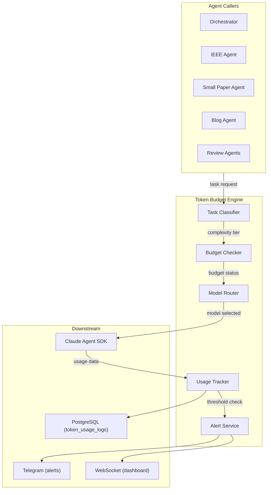

# SPEC-006: Token Budget & Model Routing Engine

**Status:** Draft
**Priority:** P0
**Phase:** 1 (Week 2) -- core; enhanced in Phase 5
**Dependencies:** None (foundational component)

---

## 1. Overview

The Token Budget Engine is the central cost-control system for Quorum. It wraps every Claude Agent SDK call to:

1. **Classify** each task by complexity to determine the appropriate model
2. **Check** the remaining token budget before execution
3. **Route** the task to the correct model, with automatic downgrades when budget is constrained
4. **Track** every token consumed per agent, per task, per session
5. **Alert** the user when budget thresholds are crossed

This is the key system that ensures intelligent token consumption as required by the project.

## 2. Architecture



## 3. Task Classification

### 3.1 Complexity Tiers

| Tier | Default Model | Input Cost/1M | Output Cost/1M | Description |
|------|--------------|---------------|----------------|-------------|
| `simple` | Haiku 4.5 | $1 | $5 | Structured extraction, formatting, summaries |
| `standard` | Sonnet 4.6 | $3 | $15 | Synthesis, writing, code generation, decisions |
| `deep` | Opus 4.6 | $5 | $25 | Novel reasoning, critical analysis, ideation |

### 3.2 Classification Rules

Each task is classified by a combination of the agent type and the task phase:

```python
TASK_CLASSIFICATION = {
    # Orchestrator tasks
    ("orchestrator", "topic_discovery"): "standard",
    ("orchestrator", "topic_ranking"): "standard",
    ("orchestrator", "status_summary"): "simple",
    ("orchestrator", "task_delegation"): "standard",

    # IEEE Agent tasks
    ("ieee", "literature_survey"): "standard",
    ("ieee", "ideation"): "deep",
    ("ieee", "scout"): "simple",
    ("ieee", "full_research"): "standard",
    ("ieee", "paper_assembly"): "standard",
    ("ieee", "self_review"): "deep",

    # Small Paper Agent tasks
    ("small_paper", "literature_scan"): "standard",
    ("small_paper", "paper_writing"): "standard",
    ("small_paper", "self_check"): "standard",

    # Blog Agent tasks
    ("blog", "topic_research"): "standard",
    ("blog", "outline"): "standard",
    ("blog", "article_writing"): "standard",
    ("blog", "code_generation"): "simple",
    ("blog", "polish"): "standard",

    # Review Agent tasks
    ("reviewer_ieee", "review"): "deep",
    ("reviewer_small", "review"): "standard",
    ("reviewer_blog", "review"): "simple",

    # Utility tasks
    ("any", "citation_formatting"): "simple",
    ("any", "metadata_extraction"): "simple",
    ("any", "bibtex_generation"): "simple",
}
```

### 3.3 Classifier Implementation

```python
class TaskClassifier:
    def __init__(self, classification_map: dict):
        self.map = classification_map

    def classify(self, agent_type: str, task_phase: str) -> str:
        key = (agent_type, task_phase)
        if key in self.map:
            return self.map[key]
        # Fallback: check wildcard
        wildcard_key = ("any", task_phase)
        if wildcard_key in self.map:
            return self.map[wildcard_key]
        # Default to standard
        return "standard"
```

## 4. Budget Management

### 4.1 Budget Configuration

Users configure budgets in Settings:

```json
{
  "token_budget": {
    "daily_limit_usd": 10.00,
    "monthly_limit_usd": 300.00,
    "alert_threshold_warning": 0.70,
    "alert_threshold_critical": 0.90,
    "auto_downgrade_enabled": true,
    "pause_on_exhaustion": true
  }
}
```

### 4.2 Budget Checker

```python
class BudgetChecker:
    async def check(self, estimated_cost: float) -> BudgetStatus:
        daily_spent = await self.get_daily_spent()
        monthly_spent = await self.get_monthly_spent()
        daily_limit = self.config.daily_limit_usd
        monthly_limit = self.config.monthly_limit_usd

        daily_remaining_pct = 1 - (daily_spent / daily_limit)
        monthly_remaining_pct = 1 - (monthly_spent / monthly_limit)
        remaining_pct = min(daily_remaining_pct, monthly_remaining_pct)

        if remaining_pct <= 0:
            return BudgetStatus.EXHAUSTED
        elif remaining_pct < 0.10:
            return BudgetStatus.CRITICAL  # < 10% remaining
        elif remaining_pct < 0.30:
            return BudgetStatus.LOW       # < 30% remaining
        elif remaining_pct < 0.70:
            return BudgetStatus.WARNING   # < 70% remaining (30-70% spent)
        else:
            return BudgetStatus.HEALTHY   # > 70% remaining
```

### 4.3 Cost Estimation

Before executing a task, estimate the cost:

```python
MODEL_COSTS = {
    "claude-opus-4-20250514": {"input": 5.0, "output": 25.0},    # per 1M tokens
    "claude-sonnet-4-20250514": {"input": 3.0, "output": 15.0},
    "claude-haiku-4-20250514": {"input": 1.0, "output": 5.0},
}

def estimate_cost(model: str, est_input_tokens: int, est_output_tokens: int) -> float:
    costs = MODEL_COSTS[model]
    input_cost = (est_input_tokens / 1_000_000) * costs["input"]
    output_cost = (est_output_tokens / 1_000_000) * costs["output"]
    return input_cost + output_cost
```

## 5. Model Routing

### 5.1 Routing Logic

```python
class ModelRouter:
    TIER_TO_MODEL = {
        "deep": "claude-opus-4-20250514",
        "standard": "claude-sonnet-4-20250514",
        "simple": "claude-haiku-4-20250514",
    }

    DOWNGRADE_MAP = {
        "claude-opus-4-20250514": "claude-sonnet-4-20250514",
        "claude-sonnet-4-20250514": "claude-haiku-4-20250514",
        "claude-haiku-4-20250514": "claude-haiku-4-20250514",  # can't downgrade further
    }

    def select_model(self, tier: str, budget_status: BudgetStatus) -> str:
        default_model = self.TIER_TO_MODEL[tier]

        if budget_status == BudgetStatus.HEALTHY:
            return default_model

        if budget_status == BudgetStatus.WARNING:
            # Downgrade deep -> standard; keep others
            if tier == "deep":
                return self.DOWNGRADE_MAP[default_model]
            return default_model

        if budget_status in (BudgetStatus.LOW, BudgetStatus.CRITICAL):
            # Downgrade everything to Haiku
            return "claude-haiku-4-20250514"

        if budget_status == BudgetStatus.EXHAUSTED:
            raise BudgetExhaustedError("Token budget exhausted. All agents paused.")

        return default_model
```

### 5.2 Downgrade Behavior Summary

| Budget Status | Remaining | Deep Tasks | Standard Tasks | Simple Tasks |
|--------------|-----------|-----------|---------------|-------------|
| HEALTHY | > 70% | Opus | Sonnet | Haiku |
| WARNING | 30-70% | **Sonnet** (downgraded) | Sonnet | Haiku |
| LOW | 10-30% | **Haiku** (downgraded) | **Haiku** (downgraded) | Haiku |
| CRITICAL | < 10% | **Haiku** (downgraded) | **Haiku** (downgraded) | Haiku |
| EXHAUSTED | 0% | **PAUSED** | **PAUSED** | **PAUSED** |

## 6. Usage Tracking

### 6.1 Tracking Flow

After every Claude Agent SDK call, extract usage data from the response messages:

```python
class UsageTracker:
    async def track(self, agent_id: str, task_id: str, messages: list) -> TokenUsageRecord:
        total_input = 0
        total_output = 0
        model_used = None

        for message in messages:
            if hasattr(message, 'usage'):
                total_input += message.usage.input_tokens
                total_output += message.usage.output_tokens
                model_used = message.model

        cost = self.calculate_cost(model_used, total_input, total_output)

        record = TokenUsageRecord(
            agent_id=agent_id,
            task_id=task_id,
            model=model_used,
            input_tokens=total_input,
            output_tokens=total_output,
            cost_usd=cost,
            timestamp=datetime.utcnow(),
        )

        await self.db.insert(record)
        await self.check_thresholds(cost)
        await self.publish_to_websocket(record)

        return record
```

### 6.2 Database Schema

```sql
CREATE TABLE token_usage_logs (
    id UUID PRIMARY KEY DEFAULT gen_random_uuid(),
    agent_id UUID NOT NULL REFERENCES agents(id),
    task_id UUID REFERENCES agent_tasks(id),
    model VARCHAR(50) NOT NULL,
    input_tokens INTEGER NOT NULL,
    output_tokens INTEGER NOT NULL,
    cache_read_tokens INTEGER DEFAULT 0,
    cache_write_tokens INTEGER DEFAULT 0,
    cost_usd DECIMAL(10, 6) NOT NULL,
    original_tier VARCHAR(20),       -- what was requested
    actual_tier VARCHAR(20),         -- what was used (after downgrade)
    was_downgraded BOOLEAN DEFAULT FALSE,
    created_at TIMESTAMP WITH TIME ZONE DEFAULT NOW()
);

CREATE INDEX idx_token_usage_agent ON token_usage_logs(agent_id);
CREATE INDEX idx_token_usage_daily ON token_usage_logs(created_at);
CREATE INDEX idx_token_usage_task ON token_usage_logs(task_id);
```

## 7. Alert System

### 7.1 Alert Levels

| Level | Trigger | Action |
|-------|---------|--------|
| INFO | Daily usage > 50% of daily limit | Dashboard notification only |
| WARNING | Daily usage > 70% of daily limit OR monthly > 70% | Telegram message + dashboard |
| CRITICAL | Daily usage > 90% OR monthly > 90% | Telegram message + dashboard + start downgrading |
| EXHAUSTED | Budget fully consumed | Telegram message + pause all agents + dashboard alert |

### 7.2 Alert Message Templates

**WARNING:**
```
Quorum Budget Alert

Daily budget: 70% consumed ($7.00 / $10.00)
Monthly budget: 45% consumed ($135.00 / $300.00)

Active agents may be downgraded to cheaper models.
Adjust budget in Settings if needed.
```

**EXHAUSTED:**
```
Quorum Budget EXHAUSTED

Daily limit of $10.00 reached.
All agents have been paused.

Resume by:
1. Increasing daily limit in Settings
2. Waiting until tomorrow (daily budget resets at 00:00 UTC)
```

## 8. Dashboard Metrics

The Token Usage page displays:

| Chart | Type | Data Source |
|-------|------|------------|
| Daily spend trend | Line chart | `token_usage_logs` grouped by day |
| Monthly spend trend | Line chart | `token_usage_logs` grouped by month |
| Budget remaining (daily) | Gauge | Current daily spend vs. limit |
| Budget remaining (monthly) | Gauge | Current monthly spend vs. limit |
| Cost by agent | Pie chart | `token_usage_logs` grouped by agent |
| Cost by model | Bar chart | `token_usage_logs` grouped by model |
| Downgrades today | Counter | Count of `was_downgraded = true` today |
| Token efficiency | Table | Input/output ratio per agent |
| Cost forecast | Line chart | Projected spend based on 7-day rolling average |

## 9. Prompt Caching (P1)

Enable prompt caching for system prompts and large static context:

- **Cache candidates**: Agent system prompts (~2-5K tokens each), IEEE LaTeX templates, niche topic lists
- **Cache TTL**: 5 minutes (Sonnet/Opus), 1 hour (Haiku)
- **Cost benefit**: Cached input tokens cost 10% of regular input tokens
- **Implementation**: Set `cache_control` in system prompt blocks via Claude API

Estimated savings with caching:
- System prompts cached across 10 sub-agent calls: ~80% reduction on prompt tokens
- Combined with model routing: potential 70-85% cost reduction vs. all-Opus baseline

## 10. Configuration API

```
GET  /api/v1/tokens/budget       -> current budget config + status
PUT  /api/v1/tokens/budget       -> update budget limits
GET  /api/v1/tokens/usage        -> usage data with filters (agent, date range, model)
GET  /api/v1/tokens/usage/daily  -> daily aggregated usage
GET  /api/v1/tokens/usage/agents -> per-agent usage breakdown
GET  /api/v1/tokens/forecast     -> 30-day cost forecast
```
