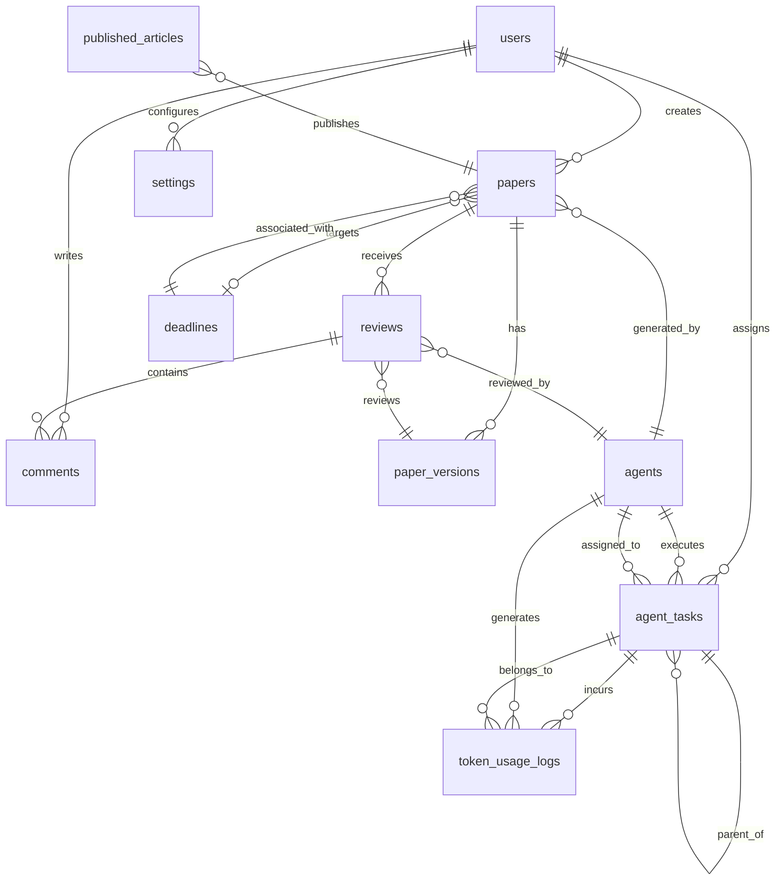

# SPEC-008: Data Model

**Status:** Draft
**Priority:** P0
**Phase:** 1 (Week 1)
**Dependencies:** None (foundational)

---

## 1. Overview

Quorum uses PostgreSQL 16 as the primary relational database. This spec defines all tables, their columns, relationships, indexes, and the migration strategy.

## 2. Entity Relationship Diagram



## 3. Table Definitions

### 3.1 users

```sql
CREATE TABLE users (
    id UUID PRIMARY KEY DEFAULT gen_random_uuid(),
    email VARCHAR(255) UNIQUE NOT NULL,
    password_hash VARCHAR(255) NOT NULL,
    display_name VARCHAR(100),
    is_active BOOLEAN DEFAULT TRUE,
    created_at TIMESTAMP WITH TIME ZONE DEFAULT NOW(),
    updated_at TIMESTAMP WITH TIME ZONE DEFAULT NOW()
);
```

### 3.2 settings

Key-value store for user configuration. Sensitive values (API keys) are AES-256 encrypted.

```sql
CREATE TABLE settings (
    id UUID PRIMARY KEY DEFAULT gen_random_uuid(),
    user_id UUID NOT NULL REFERENCES users(id) ON DELETE CASCADE,
    key VARCHAR(100) NOT NULL,
    value TEXT,
    is_encrypted BOOLEAN DEFAULT FALSE,
    created_at TIMESTAMP WITH TIME ZONE DEFAULT NOW(),
    updated_at TIMESTAMP WITH TIME ZONE DEFAULT NOW(),
    UNIQUE(user_id, key)
);
```

**Standard setting keys:**

| Key | Type | Encrypted | Description |
|-----|------|-----------|-------------|
| `anthropic_api_key` | string | Yes | Anthropic API key |
| `telegram_bot_token` | string | Yes | Telegram bot token |
| `telegram_chat_id` | string | No | User's Telegram chat ID |
| `devto_api_key` | string | Yes | dev.to API key |
| `niche_topics` | JSON array | No | `["blockchain", "autonomous vehicles", "AI"]` |
| `custom_keywords` | JSON array | No | `["V2V", "ZK-proofs", "federated learning"]` |
| `daily_budget_usd` | decimal | No | Daily token budget |
| `monthly_budget_usd` | decimal | No | Monthly token budget |
| `auto_downgrade` | boolean | No | Enable model auto-downgrade |
| `pause_on_exhaustion` | boolean | No | Pause agents when budget exhausted |
| `schedule_morning` | string | No | `"06:00"` (UTC) |
| `schedule_evening` | string | No | `"18:00"` (UTC) |
| `notification_review_ready` | boolean | No | Notify when papers ready for review |
| `notification_budget_alerts` | boolean | No | Notify on budget threshold |
| `default_publish_mode` | string | No | `"draft"` or `"live"` |

### 3.3 agents

```sql
CREATE TABLE agents (
    id UUID PRIMARY KEY DEFAULT gen_random_uuid(),
    name VARCHAR(100) NOT NULL UNIQUE,
    agent_type VARCHAR(50) NOT NULL,  -- orchestrator, ieee, small_paper, blog, reviewer_ieee, reviewer_small, reviewer_blog
    default_model VARCHAR(50) NOT NULL,
    status VARCHAR(20) DEFAULT 'idle',  -- idle, active, error, paused
    current_task_id UUID,
    total_tokens_used BIGINT DEFAULT 0,
    total_cost_usd DECIMAL(10, 4) DEFAULT 0,
    last_active_at TIMESTAMP WITH TIME ZONE,
    system_prompt_ref VARCHAR(255),  -- reference to prompt file
    created_at TIMESTAMP WITH TIME ZONE DEFAULT NOW(),
    updated_at TIMESTAMP WITH TIME ZONE DEFAULT NOW()
);
```

**Seed data (pre-populated):**

| name | agent_type | default_model |
|------|-----------|---------------|
| Research Orchestrator | orchestrator | claude-sonnet-4-20250514 |
| IEEE Research Agent | ieee | claude-opus-4-20250514 |
| Small Paper Agent | small_paper | claude-sonnet-4-20250514 |
| Blog Agent | blog | claude-sonnet-4-20250514 |
| IEEE Reviewer | reviewer_ieee | claude-opus-4-20250514 |
| Small Paper Reviewer | reviewer_small | claude-sonnet-4-20250514 |
| Blog Reviewer | reviewer_blog | claude-haiku-4-20250514 |

### 3.4 agent_tasks

```sql
CREATE TABLE agent_tasks (
    id UUID PRIMARY KEY DEFAULT gen_random_uuid(),
    agent_id UUID NOT NULL REFERENCES agents(id),
    parent_task_id UUID REFERENCES agent_tasks(id),  -- for sub-agent tasks
    user_id UUID REFERENCES users(id),
    topic TEXT NOT NULL,
    content_type VARCHAR(20) NOT NULL,  -- ieee_full, ieee_short, workshop, poster, blog
    task_phase VARCHAR(50),  -- discovery, literature_survey, ideation, writing, review, etc.
    status VARCHAR(20) DEFAULT 'queued',  -- queued, running, completed, failed, cancelled
    priority INTEGER DEFAULT 5,  -- 1 (highest) to 10 (lowest)
    input_data JSONB,  -- reference papers, configuration
    output_data JSONB,  -- result summary, file references
    target_venue VARCHAR(200),
    target_deadline_id UUID REFERENCES deadlines(id),
    session_id VARCHAR(255),  -- Claude Agent SDK session ID for context resumption
    model_used VARCHAR(50),
    started_at TIMESTAMP WITH TIME ZONE,
    completed_at TIMESTAMP WITH TIME ZONE,
    error_message TEXT,
    created_at TIMESTAMP WITH TIME ZONE DEFAULT NOW(),
    updated_at TIMESTAMP WITH TIME ZONE DEFAULT NOW()
);

CREATE INDEX idx_tasks_agent ON agent_tasks(agent_id);
CREATE INDEX idx_tasks_status ON agent_tasks(status);
CREATE INDEX idx_tasks_parent ON agent_tasks(parent_task_id);
CREATE INDEX idx_tasks_created ON agent_tasks(created_at DESC);
```

### 3.5 papers

```sql
CREATE TABLE papers (
    id UUID PRIMARY KEY DEFAULT gen_random_uuid(),
    user_id UUID NOT NULL REFERENCES users(id),
    agent_id UUID NOT NULL REFERENCES agents(id),
    task_id UUID REFERENCES agent_tasks(id),
    title VARCHAR(500) NOT NULL,
    abstract TEXT,
    paper_type VARCHAR(20) NOT NULL,  -- ieee_full, ieee_short, workshop, poster, blog
    status VARCHAR(20) DEFAULT 'draft',  -- draft, in_review, revisions_requested, approved, published, rejected
    current_version INTEGER DEFAULT 1,
    keywords JSONB,  -- array of keywords
    target_venue VARCHAR(200),
    target_deadline_id UUID REFERENCES deadlines(id),
    storage_prefix VARCHAR(500),  -- MinIO path prefix: papers/{id}/
    latex_file_key VARCHAR(500),  -- MinIO key for .tex file
    pdf_file_key VARCHAR(500),    -- MinIO key for compiled .pdf
    markdown_file_keys JSONB,     -- for blog: array of part keys
    plagiarism_score DECIMAL(5, 2),
    review_cycles INTEGER DEFAULT 0,
    published_url VARCHAR(500),
    created_at TIMESTAMP WITH TIME ZONE DEFAULT NOW(),
    updated_at TIMESTAMP WITH TIME ZONE DEFAULT NOW()
);

CREATE INDEX idx_papers_user ON papers(user_id);
CREATE INDEX idx_papers_status ON papers(status);
CREATE INDEX idx_papers_type ON papers(paper_type);
CREATE INDEX idx_papers_created ON papers(created_at DESC);
```

### 3.6 paper_versions

```sql
CREATE TABLE paper_versions (
    id UUID PRIMARY KEY DEFAULT gen_random_uuid(),
    paper_id UUID NOT NULL REFERENCES papers(id) ON DELETE CASCADE,
    version_number INTEGER NOT NULL,
    latex_file_key VARCHAR(500),
    pdf_file_key VARCHAR(500),
    markdown_file_keys JSONB,
    change_summary TEXT,  -- what changed in this version
    created_at TIMESTAMP WITH TIME ZONE DEFAULT NOW(),
    UNIQUE(paper_id, version_number)
);

CREATE INDEX idx_versions_paper ON paper_versions(paper_id);
```

### 3.7 reviews

```sql
CREATE TABLE reviews (
    id UUID PRIMARY KEY DEFAULT gen_random_uuid(),
    paper_id UUID NOT NULL REFERENCES papers(id) ON DELETE CASCADE,
    paper_version_id UUID NOT NULL REFERENCES paper_versions(id),
    reviewer_agent_id UUID NOT NULL REFERENCES agents(id),
    verdict VARCHAR(20) NOT NULL,  -- approve, revise, reject
    overall_quality INTEGER,  -- 1-10
    plagiarism_score DECIMAL(5, 2),
    feedback_json JSONB,  -- structured review feedback
    summary TEXT,
    revision_number INTEGER DEFAULT 1,
    is_human_review BOOLEAN DEFAULT FALSE,
    created_at TIMESTAMP WITH TIME ZONE DEFAULT NOW()
);

CREATE INDEX idx_reviews_paper ON reviews(paper_id);
CREATE INDEX idx_reviews_verdict ON reviews(verdict);
```

### 3.8 comments

```sql
CREATE TABLE comments (
    id UUID PRIMARY KEY DEFAULT gen_random_uuid(),
    review_id UUID REFERENCES reviews(id) ON DELETE CASCADE,
    paper_id UUID NOT NULL REFERENCES papers(id) ON DELETE CASCADE,
    user_id UUID REFERENCES users(id),  -- NULL if from agent
    agent_id UUID REFERENCES agents(id),  -- NULL if from user
    content TEXT NOT NULL,
    severity VARCHAR(20),  -- blocker, major, minor, suggestion (for agent comments)
    category VARCHAR(50),  -- format, citations, novelty, logic, writing, code, tone
    location VARCHAR(200),  -- section/page reference
    is_resolved BOOLEAN DEFAULT FALSE,
    created_at TIMESTAMP WITH TIME ZONE DEFAULT NOW()
);

CREATE INDEX idx_comments_review ON comments(review_id);
CREATE INDEX idx_comments_paper ON comments(paper_id);
```

### 3.9 token_usage_logs

```sql
CREATE TABLE token_usage_logs (
    id UUID PRIMARY KEY DEFAULT gen_random_uuid(),
    agent_id UUID NOT NULL REFERENCES agents(id),
    task_id UUID REFERENCES agent_tasks(id),
    user_id UUID NOT NULL REFERENCES users(id),
    model VARCHAR(50) NOT NULL,
    input_tokens INTEGER NOT NULL,
    output_tokens INTEGER NOT NULL,
    cache_read_tokens INTEGER DEFAULT 0,
    cache_write_tokens INTEGER DEFAULT 0,
    cost_usd DECIMAL(10, 6) NOT NULL,
    original_tier VARCHAR(20),  -- deep, standard, simple
    actual_tier VARCHAR(20),    -- what was actually used
    was_downgraded BOOLEAN DEFAULT FALSE,
    task_phase VARCHAR(50),
    created_at TIMESTAMP WITH TIME ZONE DEFAULT NOW()
);

CREATE INDEX idx_token_agent ON token_usage_logs(agent_id);
CREATE INDEX idx_token_daily ON token_usage_logs(created_at);
CREATE INDEX idx_token_task ON token_usage_logs(task_id);
CREATE INDEX idx_token_user_daily ON token_usage_logs(user_id, created_at);
```

### 3.10 deadlines

```sql
CREATE TABLE deadlines (
    id UUID PRIMARY KEY DEFAULT gen_random_uuid(),
    user_id UUID NOT NULL REFERENCES users(id),
    venue_name VARCHAR(200) NOT NULL,
    venue_type VARCHAR(20) NOT NULL,  -- conference, journal, workshop
    submission_deadline TIMESTAMP WITH TIME ZONE NOT NULL,
    notification_deadline TIMESTAMP WITH TIME ZONE,  -- camera-ready or notification of acceptance
    venue_url VARCHAR(500),
    topics JSONB,  -- relevant topic areas
    page_limit INTEGER,
    format_notes TEXT,
    is_active BOOLEAN DEFAULT TRUE,
    created_at TIMESTAMP WITH TIME ZONE DEFAULT NOW(),
    updated_at TIMESTAMP WITH TIME ZONE DEFAULT NOW()
);

CREATE INDEX idx_deadlines_date ON deadlines(submission_deadline);
CREATE INDEX idx_deadlines_active ON deadlines(is_active);
```

### 3.11 published_articles

```sql
CREATE TABLE published_articles (
    id UUID PRIMARY KEY DEFAULT gen_random_uuid(),
    paper_id UUID NOT NULL REFERENCES papers(id),
    platform VARCHAR(50) NOT NULL,  -- devto, medium
    platform_article_id VARCHAR(100),
    published_url VARCHAR(500) NOT NULL,
    series_name VARCHAR(200),
    part_number INTEGER,
    published_at TIMESTAMP WITH TIME ZONE DEFAULT NOW(),
    status VARCHAR(20) DEFAULT 'published',  -- published, draft, unpublished
    created_at TIMESTAMP WITH TIME ZONE DEFAULT NOW()
);

CREATE INDEX idx_published_paper ON published_articles(paper_id);
CREATE INDEX idx_published_platform ON published_articles(platform);
```

## 4. Aggregation Queries

### 4.1 Daily Token Usage

```sql
SELECT
    DATE(created_at) AS day,
    SUM(cost_usd) AS total_cost,
    SUM(input_tokens) AS total_input,
    SUM(output_tokens) AS total_output,
    COUNT(*) AS api_calls
FROM token_usage_logs
WHERE user_id = $1
  AND created_at >= CURRENT_DATE - INTERVAL '30 days'
GROUP BY DATE(created_at)
ORDER BY day DESC;
```

### 4.2 Per-Agent Cost Breakdown

```sql
SELECT
    a.name AS agent_name,
    a.agent_type,
    SUM(t.cost_usd) AS total_cost,
    SUM(t.input_tokens) AS total_input,
    SUM(t.output_tokens) AS total_output,
    COUNT(*) AS api_calls
FROM token_usage_logs t
JOIN agents a ON a.id = t.agent_id
WHERE t.user_id = $1
  AND t.created_at >= DATE_TRUNC('month', CURRENT_DATE)
GROUP BY a.id, a.name, a.agent_type
ORDER BY total_cost DESC;
```

### 4.3 Model Distribution

```sql
SELECT
    model,
    COUNT(*) AS call_count,
    SUM(cost_usd) AS total_cost,
    SUM(CASE WHEN was_downgraded THEN 1 ELSE 0 END) AS downgrade_count
FROM token_usage_logs
WHERE user_id = $1
  AND created_at >= CURRENT_DATE
GROUP BY model;
```

### 4.4 Current Daily Spend

```sql
SELECT COALESCE(SUM(cost_usd), 0) AS daily_spent
FROM token_usage_logs
WHERE user_id = $1
  AND created_at >= CURRENT_DATE;
```

## 5. Migration Strategy

### Tool: Alembic

```
alembic/
├── alembic.ini
├── env.py
├── script.py.mako
└── versions/
    ├── 001_initial_schema.py
    ├── 002_seed_agents.py
    └── ...
```

### Migration Workflow

```bash
# Generate migration
alembic revision --autogenerate -m "description"

# Apply migrations
alembic upgrade head

# Rollback
alembic downgrade -1
```

### Seed Data

The initial migration seeds the `agents` table with the 7 predefined agents (see Section 3.3).

## 6. Backup Strategy

- **Frequency**: Daily automated backups via `pg_dump`
- **Retention**: 30 days of daily backups, 12 months of weekly backups
- **Storage**: Compressed dumps stored in MinIO under `backups/` bucket
- **Testing**: Monthly restore test to verify backup integrity
