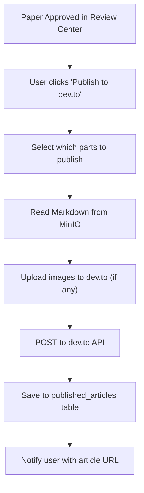

# SPEC-011: Publishing Pipeline

**Status:** Draft
**Priority:** P0
**Phase:** 6 (Week 12)
**Dependencies:** SPEC-004 (Blog Agent), SPEC-005 (Review Agents), SPEC-009 (API Contracts)

---

## 1. Overview

The Publishing Pipeline handles automated publishing of approved blog articles to dev.to, with an optional pathway for cross-posting to Medium. For IEEE and workshop papers, the pipeline provides download-ready files in the correct submission format -- actual IEEE submission requires manual upload by the user.

## 2. Platform Strategy

### 2.1 Why dev.to (Not Medium)

Medium's API has been closed to new integrations since March 2023. New developer tokens cannot be obtained. dev.to provides a fully functional REST API with the following advantages:

| Feature | dev.to | Medium |
|---------|--------|--------|
| API access | Open, active | Closed since 2023 |
| Series support | Native `series` field | Manual linking |
| Code blocks | Full syntax highlighting | Limited |
| Markdown | Native support | Limited |
| Audience | Developer-focused | General tech |
| Publishing control | Draft or live | N/A (no API) |
| Tags | Up to 4 per article | N/A |
| Canonical URL | Supported | N/A |

### 2.2 Medium Cross-Posting Workaround

After publishing on dev.to:
1. Use Medium's "Import a Story" feature (manual or via URL)
2. Medium auto-detects the canonical URL from dev.to
3. SEO is preserved since the canonical URL points to dev.to

## 3. dev.to API Integration

### 3.1 Authentication

```python
DEVTO_BASE_URL = "https://dev.to/api"

headers = {
    "api-key": user_devto_api_key,
    "Content-Type": "application/json",
}
```

### 3.2 Create Article

```python
async def publish_to_devto(
    api_key: str,
    title: str,
    body_markdown: str,
    tags: list[str],
    series: str | None = None,
    published: bool = False,
    cover_image: str | None = None,
    canonical_url: str | None = None,
    description: str | None = None,
) -> dict:
    url = f"{DEVTO_BASE_URL}/articles"
    headers = {"api-key": api_key, "Content-Type": "application/json"}

    payload = {
        "article": {
            "title": title,
            "body_markdown": body_markdown,
            "published": published,
            "tags": tags[:4],  # dev.to max 4 tags
        }
    }

    if series:
        payload["article"]["series"] = series
    if cover_image:
        payload["article"]["cover_image"] = cover_image
    if canonical_url:
        payload["article"]["canonical_url"] = canonical_url
    if description:
        payload["article"]["description"] = description

    async with httpx.AsyncClient() as client:
        response = await client.post(url, json=payload, headers=headers)
        response.raise_for_status()
        return response.json()
```

### 3.3 Update Article

```python
async def update_devto_article(
    api_key: str,
    article_id: int,
    updates: dict,
) -> dict:
    url = f"{DEVTO_BASE_URL}/articles/{article_id}"
    headers = {"api-key": api_key, "Content-Type": "application/json"}

    async with httpx.AsyncClient() as client:
        response = await client.put(url, json={"article": updates}, headers=headers)
        response.raise_for_status()
        return response.json()
```

### 3.4 Get Published Articles

```python
async def get_my_articles(api_key: str, page: int = 1) -> list[dict]:
    url = f"{DEVTO_BASE_URL}/articles/me/published?page={page}"
    headers = {"api-key": api_key}

    async with httpx.AsyncClient() as client:
        response = await client.get(url, headers=headers)
        response.raise_for_status()
        return response.json()
```

## 4. Publishing Workflow

### 4.1 Blog Article Publishing



### 4.2 Series Publishing

For multi-part blog series:

1. **Part 1 published first** (always):
   - Creates the series on dev.to via the `series` field
   - Published as draft by default
   - User can manually set to "live" from dashboard or dev.to

2. **Part 2 published after Part 1 review**:
   - Same `series` field links to Part 1
   - dev.to automatically groups them

3. **Part 3 published last**:
   - Completes the series
   - Dashboard shows series as "fully published"

### 4.3 Publish Mode

| Mode | Behavior |
|------|----------|
| Draft (default) | Article created but not visible publicly; user reviews on dev.to before going live |
| Live | Article immediately visible on dev.to |

Mode is configurable per-publish and in global settings.

## 5. IEEE Paper "Publishing"

IEEE papers cannot be auto-submitted (requires manual upload to conference systems like EDAS). The pipeline instead provides:

### 5.1 Submission-Ready Package

When a paper is approved:

```
Download Package:
├── paper.pdf          (IEEE PDF eXpress validated, if possible)
├── paper.tex          (LaTeX source)
├── references.bib     (BibTeX file)
├── figures/           (All figure files)
└── submission_notes.txt
    - Target venue: IEEE ICBC 2026
    - Deadline: July 15, 2026
    - Page count: 8 (excluding references)
    - Format: IEEE Conference 2-column
    - Submission URL: https://edas.info/...
```

### 5.2 Download Endpoint

```
GET /api/v1/papers/:id/download?format=submission_package
```

Returns a ZIP file with all paper files.

### 5.3 Submission Checklist (Dashboard)

For each approved IEEE paper, the dashboard shows:

- [ ] Paper PDF generated
- [ ] IEEE PDF eXpress validation passed (manual step)
- [ ] Author information added (user must add before submission)
- [ ] Target venue selected
- [ ] Deadline confirmed
- [ ] Submission system URL available

## 6. Image Handling

### 6.1 Blog Images

Blog articles may contain:
- Mermaid diagrams (rendered to PNG)
- Architecture diagrams (generated by agent)
- Code output screenshots

**Upload strategy:**

Option A (preferred): Use publicly accessible MinIO URLs with presigned links
Option B: Upload to dev.to via their image upload API (if available)
Option C: Host on an image CDN (e.g., Cloudflare R2 with public bucket)

### 6.2 IEEE Paper Figures

IEEE figures are embedded in LaTeX via `\includegraphics`. They are stored in MinIO alongside the paper files and compiled into the PDF by Tectonic.

## 7. Published Article Tracking

### 7.1 Database Record

```json
{
  "id": "uuid",
  "paper_id": "uuid",
  "platform": "devto",
  "platform_article_id": "1234567",
  "published_url": "https://dev.to/harish/blockchain-av-trust-part-1-abc123",
  "series_name": "Building a Blockchain-Powered AV Trust System",
  "part_number": 1,
  "published_at": "2026-04-10T15:00:00Z",
  "status": "published"
}
```

### 7.2 Dashboard View

The Files Explorer shows published articles with:
- Platform icon (dev.to logo)
- Direct link to published article
- Published date
- View count (fetched periodically from dev.to API)
- Series grouping

## 8. Error Handling

| Error | Recovery |
|-------|---------|
| dev.to API returns 401 | API key invalid; prompt user to update in Settings |
| dev.to API returns 422 | Validation error; check tags (max 4), title length, body format |
| dev.to API returns 429 | Rate limited; retry after 60s with exponential backoff |
| Image upload fails | Publish article without images; notify user to add manually |
| Series linking fails | Publish standalone; user can manually link in dev.to editor |
| Duplicate article detected | Check `canonical_url` for uniqueness; warn user |

## 9. Future Enhancements (P2)

- **Hashnode integration**: Another developer blogging platform with API
- **LinkedIn article posting**: For professional visibility
- **Automated Medium import**: If Medium reopens API access
- **Analytics aggregation**: Pull view counts, reactions, and comments from dev.to into dashboard
- **Scheduled publishing**: Publish at optimal times for engagement
