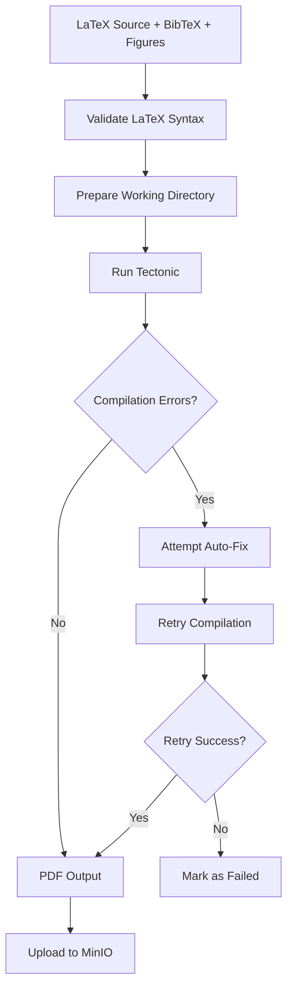

# SPEC-012: LaTeX Compilation Pipeline

**Status:** Draft
**Priority:** P0
**Phase:** 3 (Week 5)
**Dependencies:** SPEC-002 (IEEE Agent), SPEC-003 (Small Paper Agent)

---

## 1. Overview

The LaTeX Pipeline compiles `.tex` source files into PDFs using the Tectonic engine. It handles template management, compilation, error recovery, and PDF preview generation. This pipeline is critical for IEEE and workshop papers.

## 2. Technology: Tectonic

### 2.1 Why Tectonic

| Feature | Tectonic | Traditional TeX Live |
|---------|----------|---------------------|
| Installation | Single binary, ~20MB | 3-7 GB full install |
| Package management | Auto-downloads from CTAN on demand | Manual `tlmgr` |
| Build system | Single command, deterministic | Multiple passes (pdflatex, bibtex, pdflatex, pdflatex) |
| Docker-friendly | Small image footprint | Large image |
| XeTeX support | Built-in | Requires separate install |

### 2.2 Installation

```bash
# Linux (Dockerfile)
curl --proto '=https' --tlsv1.2 -fsSL https://drop-sh.fullyjustified.net | sh

# macOS
brew install tectonic

# Docker
FROM rust:slim AS builder
RUN cargo install tectonic

# Or use pre-built: ghcr.io/tectonic-typesetting/tectonic:latest
```

### 2.3 Alternative: node-latex-compiler

For the Node.js/TypeScript frontend preview system:

```typescript
import { compile } from 'node-latex-compiler';

const pdf = await compile({
  text: latexSource,
  returnBuffer: true,
});
```

## 3. Template Management

### 3.1 Template Directory Structure

```
agents/ieee/templates/
├── ieee-conference.tex      # 2-column conference template
├── ieee-journal.tex         # Journal template
├── ieee-short.tex           # 4-page short paper
├── ieee-poster.tex          # 2-page poster
├── IEEEtran.cls             # IEEE document class (bundled)
├── IEEEtran.bst             # IEEE bibliography style
└── common/
    ├── packages.tex          # Common package imports
    └── macros.tex            # Shared custom macros
```

### 3.2 IEEE Conference Template

```latex
% agents/ieee/templates/ieee-conference.tex
\documentclass[conference]{IEEEtran}

% Common packages
\usepackage{cite}
\usepackage{amsmath,amssymb,amsfonts}
\usepackage{algorithmic}
\usepackage{algorithm}
\usepackage{graphicx}
\usepackage{textcomp}
\usepackage{xcolor}
\usepackage{hyperref}
\usepackage{booktabs}
\usepackage{multirow}
\usepackage{subcaption}
\usepackage{url}
\usepackage{listings}

% Code listing style
\lstset{
  basicstyle=\ttfamily\small,
  breaklines=true,
  frame=single,
  numbers=left,
  numberstyle=\tiny,
}

\begin{document}

\title{<<TITLE>>}

\author{
  \IEEEauthorblockN{<<AUTHOR_NAME>>}
  \IEEEauthorblockA{
    \textit{<<AFFILIATION>>} \\
    <<CITY_COUNTRY>> \\
    <<EMAIL>>
  }
}

\maketitle

\begin{abstract}
<<ABSTRACT>>
\end{abstract}

\begin{IEEEkeywords}
<<KEYWORDS>>
\end{IEEEkeywords}

<<BODY>>

\bibliographystyle{IEEEtran}
\bibliography{references}

\end{document}
```

Agents replace `<<PLACEHOLDER>>` markers with generated content.

## 4. Compilation Pipeline

### 4.1 Compilation Flow



### 4.2 Compilation Service

```python
import subprocess
import tempfile
import shutil
from pathlib import Path

class LaTeXCompiler:
    def __init__(self, tectonic_path: str = "tectonic"):
        self.tectonic = tectonic_path

    async def compile(
        self,
        tex_content: str,
        bib_content: str | None = None,
        figures: dict[str, bytes] | None = None,
    ) -> CompilationResult:
        with tempfile.TemporaryDirectory() as tmpdir:
            workdir = Path(tmpdir)

            # Write main .tex file
            tex_path = workdir / "paper.tex"
            tex_path.write_text(tex_content)

            # Write .bib file if provided
            if bib_content:
                bib_path = workdir / "references.bib"
                bib_path.write_text(bib_content)

            # Write figure files
            if figures:
                fig_dir = workdir / "figures"
                fig_dir.mkdir()
                for name, data in figures.items():
                    (fig_dir / name).write_bytes(data)

            # Copy IEEEtran.cls and .bst if not available via Tectonic
            self._copy_ieee_files(workdir)

            # Run Tectonic
            result = subprocess.run(
                [self.tectonic, "-X", "compile", str(tex_path)],
                capture_output=True,
                text=True,
                cwd=str(workdir),
                timeout=120,
            )

            if result.returncode == 0:
                pdf_path = workdir / "paper.pdf"
                return CompilationResult(
                    success=True,
                    pdf_bytes=pdf_path.read_bytes(),
                    log=result.stdout,
                )
            else:
                return CompilationResult(
                    success=False,
                    pdf_bytes=None,
                    log=result.stderr,
                    errors=self._parse_errors(result.stderr),
                )

    def _parse_errors(self, log: str) -> list[str]:
        errors = []
        for line in log.split("\n"):
            if line.startswith("!") or "Error" in line:
                errors.append(line.strip())
        return errors
```

### 4.3 Auto-Fix Common Errors

```python
COMMON_FIXES = {
    r"Undefined control sequence.*\\citep": (
        r"\\citep{", r"\\cite{"  # citep -> cite for IEEE
    ),
    r"Missing \$ inserted": None,  # math mode issue, needs context
    r"Too many unprocessed floats": (
        "", r"\clearpage\n"  # add clearpage before problematic float
    ),
    r"File .* not found": None,  # missing figure, needs agent re-generation
    r"Undefined citation": None,  # missing bib entry, needs agent fix
}

def attempt_auto_fix(tex_content: str, errors: list[str]) -> str | None:
    fixed = tex_content
    for error in errors:
        for pattern, fix in COMMON_FIXES.items():
            if re.search(pattern, error) and fix:
                old, new = fix
                fixed = fixed.replace(old, new, 1)
                return fixed
    return None  # no auto-fix available
```

## 5. PDF Preview

### 5.1 Browser Preview via PDF.js

The dashboard uses PDF.js to render PDFs in the Review Center:

```typescript
// frontend/components/review/DocumentViewer.tsx
import { useState } from 'react';
import { Document, Page } from 'react-pdf';

interface Props {
  pdfUrl: string;
}

function DocumentViewer({ pdfUrl }: Props) {
  const [numPages, setNumPages] = useState(0);
  const [currentPage, setCurrentPage] = useState(1);

  return (
    <div>
      <Document
        file={pdfUrl}
        onLoadSuccess={({ numPages }) => setNumPages(numPages)}
      >
        <Page pageNumber={currentPage} width={600} />
      </Document>
      <div>
        Page {currentPage} of {numPages}
        <button onClick={() => setCurrentPage(p => Math.max(1, p - 1))}>Prev</button>
        <button onClick={() => setCurrentPage(p => Math.min(numPages, p + 1))}>Next</button>
      </div>
    </div>
  );
}
```

### 5.2 Presigned URL for PDF Access

```python
async def get_pdf_preview_url(paper_id: str) -> str:
    paper = await get_paper(paper_id)
    url = minio_client.presigned_get_object(
        bucket_name="papers",
        object_name=paper.pdf_file_key,
        expires=timedelta(hours=1),
    )
    return url
```

## 6. Citation Validation

### 6.1 BibTeX Parser

```python
import bibtexparser

def parse_bibtex(bib_content: str) -> list[dict]:
    parser = bibtexparser.parse(bib_content)
    entries = []
    for entry in parser.entries:
        entries.append({
            "key": entry.key,
            "type": entry.entry_type,
            "title": entry.fields_dict.get("title", {}).value if "title" in entry.fields_dict else None,
            "author": entry.fields_dict.get("author", {}).value if "author" in entry.fields_dict else None,
            "year": entry.fields_dict.get("year", {}).value if "year" in entry.fields_dict else None,
            "doi": entry.fields_dict.get("doi", {}).value if "doi" in entry.fields_dict else None,
        })
    return entries
```

### 6.2 Validation Against APIs

For each BibTeX entry:

1. If DOI present: query OpenAlex by DOI -> verify title and authors match
2. If no DOI: query Semantic Scholar by title -> check for approximate match (>85% similarity)
3. Mark entries as `verified`, `unverified`, or `hallucinated`
4. Report: "15/15 citations verified" or "2/15 citations could not be verified"

## 7. IEEE PDF eXpress Compatibility

IEEE requires final camera-ready papers to pass PDF eXpress validation. While Quorum cannot directly integrate with IEEE PDF eXpress (requires IEEE account), the compilation pipeline ensures:

- Tectonic uses Type 1 fonts (not Type 3)
- PDF version 1.5+ output
- All fonts embedded
- Images at sufficient resolution (300 DPI minimum)
- Correct page dimensions (US Letter: 8.5" x 11")

Users should still run their final paper through IEEE PDF eXpress as a manual step before submission.

## 8. Performance

| Operation | Target Time |
|-----------|------------|
| Template loading | < 100ms |
| LaTeX compilation (8-page paper) | < 30 seconds |
| PDF upload to MinIO | < 5 seconds |
| Presigned URL generation | < 100ms |
| Citation validation (15 entries) | < 30 seconds (API calls) |

## 9. Error Handling

| Error | Recovery |
|-------|---------|
| Tectonic not installed | Check on startup; fail with clear error message |
| Compilation timeout (>120s) | Kill process; report timeout error; may need to simplify document |
| Package download failure | Retry once; if CTAN is down, use cached packages |
| Missing figure reference | Remove `\includegraphics` line; add TODO comment; flag for agent |
| Invalid BibTeX entry | Remove entry; flag missing citation for agent |
| PDF exceeds page limit | Report exact page count; agent must trim content |
