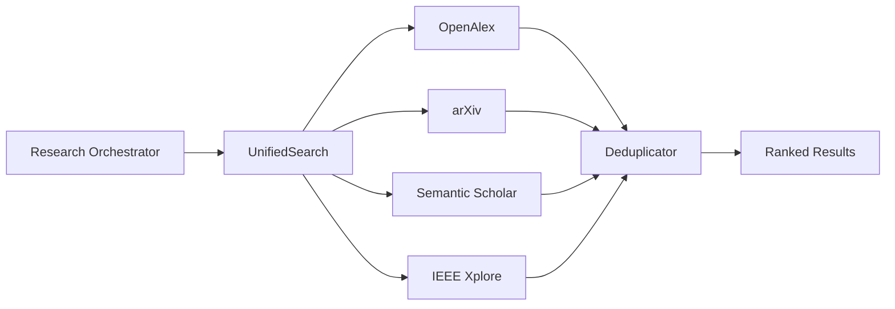

# SPEC-014: Paper Search API Integrations

**Status:** Draft
**Priority:** P0
**Phase:** 2 (Week 3)
**Dependencies:** SPEC-001 (Orchestrator)

---

## 1. Overview

Quorum integrates with four academic paper search APIs to discover trending topics and find reference papers. The search layer provides a unified interface that queries all four APIs, normalizes results into a common format, and deduplicates across sources.

## 2. API Summary

| API | Auth | Rate Limit | Coverage | Cost |
|-----|------|-----------|----------|------|
| OpenAlex | None (polite pool) | ~10 req/s (polite) | 250M+ works | Free |
| arXiv | None | 1 req/3s | Preprints (CS, Physics, Math) | Free |
| Semantic Scholar | API key (free) | 100 req/5min (with key) | 200M+ papers | Free |
| IEEE Xplore | API key (registration) | Varies by plan | IEEE/IET publications | Free tier available |

## 3. OpenAlex Integration

### 3.1 Overview

OpenAlex is the primary search source: free, no authentication, 250M+ scholarly works.

### 3.2 Endpoints

Base URL: `https://api.openalex.org`

| Endpoint | Purpose |
|----------|---------|
| `/works` | Search papers by topic, filter by date, sort by citations |
| `/concepts` | Browse topic taxonomy |
| `/authors` | Author metadata |

### 3.3 Implementation

```python
import httpx

class OpenAlexClient:
    BASE_URL = "https://api.openalex.org"

    def __init__(self, email: str | None = None):
        self.email = email  # for polite pool (higher rate limits)

    async def search_papers(
        self,
        query: str,
        from_date: str | None = None,
        sort_by: str = "cited_by_count:desc",
        per_page: int = 25,
    ) -> list[dict]:
        params = {
            "search": query,
            "sort": sort_by,
            "per_page": per_page,
        }

        if from_date:
            params["filter"] = f"from_publication_date:{from_date}"

        if self.email:
            params["mailto"] = self.email

        async with httpx.AsyncClient() as client:
            response = await client.get(
                f"{self.BASE_URL}/works",
                params=params,
                timeout=30,
            )
            response.raise_for_status()
            data = response.json()

        return [self._normalize(work) for work in data.get("results", [])]

    async def search_trending(
        self,
        topics: list[str],
        days_back: int = 7,
    ) -> list[dict]:
        from_date = (datetime.now() - timedelta(days=days_back)).strftime("%Y-%m-%d")
        all_results = []
        for topic in topics:
            results = await self.search_papers(
                query=topic,
                from_date=from_date,
                sort_by="publication_date:desc",
            )
            all_results.extend(results)
        return all_results

    def _normalize(self, work: dict) -> dict:
        return {
            "source": "openalex",
            "id": work.get("id", ""),
            "doi": work.get("doi", ""),
            "title": work.get("title", ""),
            "abstract": work.get("abstract_inverted_index", {}),  # inverted index format
            "authors": [
                a.get("author", {}).get("display_name", "")
                for a in work.get("authorships", [])
            ],
            "publication_date": work.get("publication_date", ""),
            "venue": work.get("primary_location", {}).get("source", {}).get("display_name", ""),
            "citation_count": work.get("cited_by_count", 0),
            "open_access": work.get("open_access", {}).get("is_oa", False),
            "url": work.get("primary_location", {}).get("landing_page_url", ""),
        }
```

### 3.4 OpenAlex-Specific Notes

- Abstract is returned as an inverted index (word -> positions). Must be reconstructed:
  ```python
  def reconstruct_abstract(inverted_index: dict) -> str:
      if not inverted_index:
          return ""
      word_positions = []
      for word, positions in inverted_index.items():
          for pos in positions:
              word_positions.append((pos, word))
      word_positions.sort()
      return " ".join(word for _, word in word_positions)
  ```
- Use `mailto` parameter for polite pool access (higher rate limits)
- Concepts (topics) use Wikidata IDs for categorization

## 4. arXiv Integration

### 4.1 Overview

arXiv provides free access to preprints. The API returns Atom XML feeds.

### 4.2 Endpoint

Base URL: `http://export.arxiv.org/api/query`

### 4.3 Implementation

```python
import httpx
import xml.etree.ElementTree as ET

class ArxivClient:
    BASE_URL = "http://export.arxiv.org/api/query"

    # Relevant categories for Quorum
    CATEGORIES = {
        "blockchain": "cs.CR",     # Cryptography and Security
        "autonomous_vehicles": "cs.RO",  # Robotics
        "ai": "cs.AI",            # Artificial Intelligence
        "machine_learning": "cs.LG",  # Machine Learning
        "distributed": "cs.DC",   # Distributed Computing
    }

    async def search_papers(
        self,
        query: str,
        categories: list[str] | None = None,
        max_results: int = 25,
        sort_by: str = "submittedDate",
        sort_order: str = "descending",
    ) -> list[dict]:
        search_query = f'all:"{query}"'

        if categories:
            cat_filter = " OR ".join(f"cat:{c}" for c in categories)
            search_query = f"({search_query}) AND ({cat_filter})"

        params = {
            "search_query": search_query,
            "start": 0,
            "max_results": max_results,
            "sortBy": sort_by,
            "sortOrder": sort_order,
        }

        async with httpx.AsyncClient() as client:
            response = await client.get(self.BASE_URL, params=params, timeout=30)
            response.raise_for_status()

        return self._parse_atom_feed(response.text)

    async def search_trending(
        self, topics: list[str], categories: list[str] | None = None
    ) -> list[dict]:
        all_results = []
        for topic in topics:
            # Rate limit: 1 request per 3 seconds
            await asyncio.sleep(3)
            results = await self.search_papers(
                query=topic,
                categories=categories,
                max_results=10,
            )
            all_results.extend(results)
        return all_results

    def _parse_atom_feed(self, xml_text: str) -> list[dict]:
        ns = {"atom": "http://www.w3.org/2005/Atom", "arxiv": "http://arxiv.org/schemas/atom"}
        root = ET.fromstring(xml_text)
        results = []

        for entry in root.findall("atom:entry", ns):
            arxiv_id = entry.find("atom:id", ns).text.split("/abs/")[-1]

            authors = [
                author.find("atom:name", ns).text
                for author in entry.findall("atom:author", ns)
            ]

            categories = [
                cat.get("term")
                for cat in entry.findall("arxiv:primary_category", ns)
            ]

            results.append({
                "source": "arxiv",
                "id": f"arxiv:{arxiv_id}",
                "doi": "",
                "title": entry.find("atom:title", ns).text.strip().replace("\n", " "),
                "abstract": entry.find("atom:summary", ns).text.strip().replace("\n", " "),
                "authors": authors,
                "publication_date": entry.find("atom:published", ns).text[:10],
                "venue": f"arXiv {', '.join(categories)}",
                "citation_count": 0,  # arXiv doesn't provide citation counts
                "open_access": True,
                "url": f"https://arxiv.org/abs/{arxiv_id}",
            })

        return results
```

### 4.4 arXiv-Specific Notes

- Rate limit: 1 request per 3 seconds (enforced via `asyncio.sleep`)
- No citation counts available (use Semantic Scholar for citation data)
- Abstracts and titles may contain LaTeX math notation
- Categories are hierarchical (e.g., `cs.CR` = Computer Science > Cryptography)

## 5. Semantic Scholar Integration

### 5.1 Overview

Semantic Scholar provides AI-powered paper recommendations and citation data. Free API key required for higher rate limits.

### 5.2 Endpoints

Base URL: `https://api.semanticscholar.org/graph/v1`

| Endpoint | Purpose |
|----------|---------|
| `/paper/search` | Search papers by keywords |
| `/paper/{paper_id}` | Get paper details |
| `/paper/{paper_id}/citations` | Get papers that cite this paper |
| `/paper/{paper_id}/references` | Get papers cited by this paper |
| `/recommendations/v1/papers/` | Get paper recommendations |

### 5.3 Implementation

```python
class SemanticScholarClient:
    BASE_URL = "https://api.semanticscholar.org/graph/v1"

    def __init__(self, api_key: str | None = None):
        self.headers = {}
        if api_key:
            self.headers["x-api-key"] = api_key

    async def search_papers(
        self,
        query: str,
        year: str | None = None,
        fields: str = "title,abstract,authors,year,venue,citationCount,externalIds,openAccessPdf,publicationDate",
        limit: int = 25,
    ) -> list[dict]:
        params = {
            "query": query,
            "fields": fields,
            "limit": limit,
        }
        if year:
            params["year"] = year

        async with httpx.AsyncClient() as client:
            response = await client.get(
                f"{self.BASE_URL}/paper/search",
                params=params,
                headers=self.headers,
                timeout=30,
            )
            response.raise_for_status()
            data = response.json()

        return [self._normalize(paper) for paper in data.get("data", [])]

    async def get_paper_by_doi(self, doi: str) -> dict | None:
        async with httpx.AsyncClient() as client:
            response = await client.get(
                f"{self.BASE_URL}/paper/DOI:{doi}",
                params={"fields": "title,authors,year,venue,citationCount"},
                headers=self.headers,
                timeout=15,
            )
            if response.status_code == 404:
                return None
            response.raise_for_status()
            return self._normalize(response.json())

    async def verify_citation(self, title: str) -> dict | None:
        results = await self.search_papers(query=title, limit=3)
        if results:
            for r in results:
                similarity = self._title_similarity(title, r["title"])
                if similarity > 0.85:
                    return r
        return None

    def _normalize(self, paper: dict) -> dict:
        external_ids = paper.get("externalIds", {}) or {}
        authors = paper.get("authors", []) or []

        return {
            "source": "semantic_scholar",
            "id": paper.get("paperId", ""),
            "doi": external_ids.get("DOI", ""),
            "title": paper.get("title", ""),
            "abstract": paper.get("abstract", ""),
            "authors": [a.get("name", "") for a in authors],
            "publication_date": paper.get("publicationDate", ""),
            "venue": paper.get("venue", ""),
            "citation_count": paper.get("citationCount", 0),
            "open_access": bool(paper.get("openAccessPdf")),
            "url": f"https://api.semanticscholar.org/CorpusID:{paper.get('paperId', '')}",
        }

    def _title_similarity(self, t1: str, t2: str) -> float:
        s1 = set(t1.lower().split())
        s2 = set(t2.lower().split())
        if not s1 or not s2:
            return 0.0
        return len(s1 & s2) / len(s1 | s2)
```

### 5.4 Semantic Scholar-Specific Notes

- API key provides 100 requests per 5 minutes (vs 100 per 5 minutes unauthenticated but with lower burst)
- Paper IDs can be DOI, arXiv ID, Corpus ID, or PMID
- The `verify_citation` method is critical for SPEC-002 (IEEE Agent) citation validation

## 6. IEEE Xplore Integration

### 6.1 Overview

IEEE Xplore provides access to IEEE and IET publications. Requires a developer API key obtained from developer.ieee.org.

### 6.2 Endpoint

Base URL: `https://ieeexploreapi.ieee.org/api/v1/search/articles`

### 6.3 Implementation

```python
class IEEEXploreClient:
    BASE_URL = "https://ieeexploreapi.ieee.org/api/v1/search/articles"

    def __init__(self, api_key: str):
        self.api_key = api_key

    async def search_papers(
        self,
        query: str,
        start_year: int | None = None,
        end_year: int | None = None,
        content_type: str | None = None,  # Conferences, Journals, Standards
        max_records: int = 25,
    ) -> list[dict]:
        params = {
            "querytext": query,
            "apikey": self.api_key,
            "max_records": max_records,
            "sort_field": "article_date",
            "sort_order": "desc",
        }

        if start_year:
            params["start_year"] = start_year
        if end_year:
            params["end_year"] = end_year
        if content_type:
            params["content_type"] = content_type

        async with httpx.AsyncClient() as client:
            response = await client.get(
                self.BASE_URL,
                params=params,
                timeout=30,
            )
            response.raise_for_status()
            data = response.json()

        articles = data.get("articles", [])
        return [self._normalize(article) for article in articles]

    def _normalize(self, article: dict) -> dict:
        authors = article.get("authors", {}).get("authors", [])

        return {
            "source": "ieee_xplore",
            "id": f"ieee:{article.get('article_number', '')}",
            "doi": article.get("doi", ""),
            "title": article.get("title", ""),
            "abstract": article.get("abstract", ""),
            "authors": [a.get("full_name", "") for a in authors],
            "publication_date": article.get("publication_date", ""),
            "venue": article.get("publication_title", ""),
            "citation_count": article.get("citing_paper_count", 0),
            "open_access": article.get("access_type", "") == "OPEN_ACCESS",
            "url": article.get("html_url", ""),
        }
```

### 6.4 IEEE Xplore-Specific Notes

- API key must be requested from developer.ieee.org (issued during business hours)
- All parameter values should be URL-encoded
- Response is JSON by default (XML available)
- Some fields (full text, PDF) require institutional subscription

## 7. Unified Search Interface

### 7.1 Architecture



### 7.2 Implementation

```python
class UnifiedSearch:
    def __init__(
        self,
        openalex: OpenAlexClient,
        arxiv: ArxivClient,
        semantic_scholar: SemanticScholarClient,
        ieee_xplore: IEEEXploreClient | None = None,
    ):
        self.sources = {
            "openalex": openalex,
            "arxiv": arxiv,
            "semantic_scholar": semantic_scholar,
        }
        if ieee_xplore:
            self.sources["ieee_xplore"] = ieee_xplore

    async def search(
        self,
        topics: list[str],
        days_back: int = 7,
        max_per_source: int = 15,
    ) -> list[dict]:
        all_results = []

        tasks = []
        for topic in topics:
            for source_name, client in self.sources.items():
                if source_name == "openalex":
                    tasks.append(client.search_papers(query=topic, per_page=max_per_source))
                elif source_name == "arxiv":
                    tasks.append(client.search_papers(query=topic, max_results=max_per_source))
                elif source_name == "semantic_scholar":
                    tasks.append(client.search_papers(query=topic, limit=max_per_source))
                elif source_name == "ieee_xplore":
                    tasks.append(client.search_papers(query=topic, max_records=max_per_source))

        results = await asyncio.gather(*tasks, return_exceptions=True)

        for result in results:
            if isinstance(result, Exception):
                continue  # log and skip failed sources
            all_results.extend(result)

        return self._deduplicate(all_results)

    def _deduplicate(self, papers: list[dict]) -> list[dict]:
        seen_dois = set()
        seen_titles = set()
        unique = []

        for paper in papers:
            doi = paper.get("doi", "").strip()
            title_key = paper.get("title", "").lower().strip()

            if doi and doi in seen_dois:
                continue
            if title_key in seen_titles:
                continue

            if doi:
                seen_dois.add(doi)
            seen_titles.add(title_key)
            unique.append(paper)

        return unique
```

## 8. Normalized Paper Schema

All sources return data in this common format:

```typescript
interface NormalizedPaper {
  source: "openalex" | "arxiv" | "semantic_scholar" | "ieee_xplore";
  id: string;           // source-specific identifier
  doi: string;          // Digital Object Identifier (may be empty)
  title: string;
  abstract: string;
  authors: string[];    // list of author names
  publication_date: string;  // ISO date (YYYY-MM-DD)
  venue: string;        // journal/conference name
  citation_count: number;
  open_access: boolean;
  url: string;          // link to paper page
}
```

## 9. Rate Limiting Strategy

```python
class RateLimiter:
    def __init__(self):
        self.limits = {
            "openalex": (10, 1),        # 10 requests per 1 second
            "arxiv": (1, 3),            # 1 request per 3 seconds
            "semantic_scholar": (20, 60), # 20 requests per 60 seconds
            "ieee_xplore": (10, 60),    # 10 requests per 60 seconds (estimate)
        }
        self.last_request = {}

    async def wait_if_needed(self, source: str):
        if source not in self.limits:
            return
        max_requests, window_seconds = self.limits[source]
        # Simple token bucket implementation
        ...
```

## 10. Caching

- Cache search results in Redis with 1-hour TTL
- Cache individual paper metadata with 24-hour TTL
- Cache key format: `search:{source}:{query_hash}` and `paper:{source}:{id}`
- Reduces API calls during the same discovery cycle (morning + evening)

## 11. Error Handling

| Error | Recovery |
|-------|---------|
| OpenAlex timeout | Retry once; skip if still failing (non-critical source) |
| arXiv rate limit (HTTP 429) | Back off 30 seconds; retry |
| Semantic Scholar API key invalid | Log error; skip source; notify user in Settings |
| IEEE Xplore key not configured | Skip source; all other sources still functional |
| All sources fail | Cancel discovery cycle; notify user; retry in 30 minutes |
| Malformed response | Log warning; skip individual result; continue with others |
